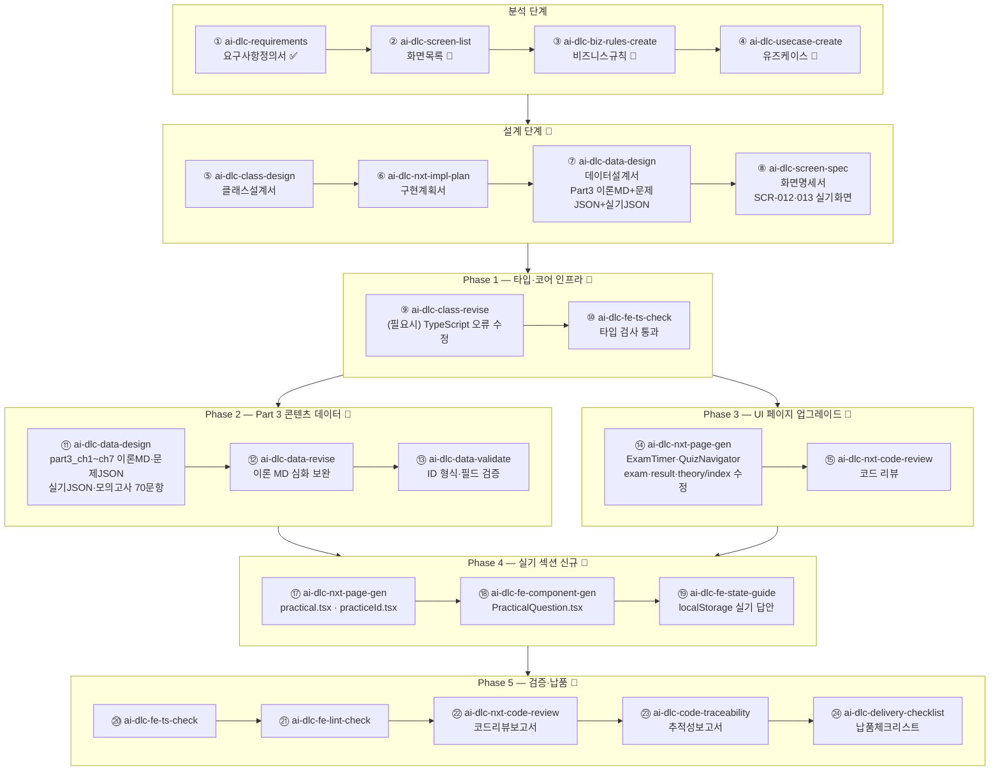

# docs/ai-dlc — AI-DLC 산출물 아카이브

ai-dlc* 스킬로 생성되는 **모든 분석·설계 산출물**이 이 디렉터리에 저장된다.  
CLAUDE.md의 "AI-DLC 산출물 저장 필수 규칙"에 의해 강제 관리된다.

> **프로젝트**: SQLD → SQLP 전환 (2과목 50문항 90분 → 3과목 70+2문항 180분)  
> **현재 단계**: 요구사항 분석 완료 → 화면목록 작성 예정

---

## 스킬 적용 순서 및 산출물

### ✅ 완료된 스킬

| 순서 | 스킬 | 단계 | 산출물 | 상태 |
|:---:|:---|:---:|:---|:---:|
| 1 | `ai-dlc-requirements` | 분석 | [요구사항정의서_SQLP_20260604.md](요구사항정의서_SQLP_20260604.md) — FR 23건·PR 3건·SR 1건·QR 2건·IR 2건·DR 4건·CR 4건, 총 39건 | ✅ |
| 2 | `ai-dlc-screen-list` | 분석 | [화면목록_SQLP_20260604.md](화면목록_SQLP_20260604.md) — SCR 11건, FR 23건 100% 커버리지 | ✅ |

---

### 🔄 앞으로 적용할 스킬

#### 분석 단계 (Analysis)

| 순서 | 스킬 | 용도 | 예상 산출물 |
|:---:|:---|:---|:---|
| 2 | `ai-dlc-screen-list` | SQLP 사이트 전체 화면 목록 도출 | `화면목록_SQLP_YYYYMMDD.md` |
| 3 | `ai-dlc-biz-rules-create` | 합격 판정·문제 ID·자기채점 등 비즈니스 규칙 정의 | `비즈니스규칙_SQLP_YYYYMMDD.md` |
| 4 | `ai-dlc-usecase-create` | 학습자 행위 기반 유즈케이스 도출 | `유즈케이스_SQLP_YYYYMMDD.md` |

**분석 단계 입력 소스:**
- `docs/ai-dlc/요구사항정의서_SQLP_20260604.md` (FR-001~FR-023)
- `CLAUDE.md`, `docs/harness/PRD.md`

---

#### 설계 단계 (Design)

| 순서 | 스킬 | 용도 | 예상 산출물 |
|:---:|:---|:---|:---|
| 5 | `ai-dlc-class-design` | TypeScript 인터페이스·클래스 설계 | `클래스설계서_SQLP_YYYYMMDD.md` |
| 6 | `ai-dlc-nxt-impl-plan` | Next.js 기반 구현 계획 수립 | `구현계획서_SQLP_YYYYMMDD.md` |
| 7 | `ai-dlc-data-design` | Part 3 이론MD·문제JSON·실기JSON 구조 설계 | `데이터설계서_SQLP_YYYYMMDD.md` |
| 8 | `ai-dlc-screen-spec` | 실기 화면(SCR-012·013) 상세 명세 | `화면명세서_SQLP_YYYYMMDD.md` |

---

#### Phase 1 — 타입 & 코어 인프라 구현

클래스설계서·데이터설계서를 바탕으로 Foundation Builder(Agent 3)가 실제 코드를 구현한다.

| 순서 | 스킬 | 용도 | 대상 파일 |
|:---:|:---|:---|:---|
| 9 | `ai-dlc-class-revise` | types/index.ts 수정 후 TypeScript 오류 연쇄 수정 (필요 시) | `types/index.ts` |
| 10 | `ai-dlc-fe-ts-check` | 타입 검사 통과 확인 | — |

**구현 목표:**
- `types/index.ts`: `Question.part: 1|2|3`, `PracticalQuestion`, `PracticalAnswer`, `ExamResult.part3Score`
- `lib/chapters.ts`: 12챕터 (Part 3 7개 추가)
- `lib/progress.ts`: localStorage 키 `'sqlp_progress'`, 70문항 샘플링
- `lib/questions.ts`: Part 3 파일 로딩, 모의고사 P1:10+P2:20+P3:40

---

#### Phase 2 — Part 3 콘텐츠 데이터 생성

Content Writer(Agent 2)가 3과목 이론·문제·실기 데이터를 생성한다.

| 순서 | 스킬 | 용도 | 예상 산출물 |
|:---:|:---|:---|:---|
| 11 | `ai-dlc-data-design` | Part 3 이론 MD 초안 생성 | `data/theory/part3_ch1~ch7.md` (7개) |
| 12 | `ai-dlc-data-revise` | 이론 MD 내용 심화·보완 | 이론 MD 수정본 |
| 13 | `ai-dlc-data-validate` | 문제 JSON ID 형식·필드 검증 | 검증 보고 |

**생성 목표:**
```
data/theory/
  part3_ch1.md  SQL 수행 구조
  part3_ch2.md  SQL 분석 도구
  part3_ch3.md  인덱스 튜닝
  part3_ch4.md  조인 튜닝
  part3_ch5.md  SQL 옵티마이저
  part3_ch6.md  고급 SQL 튜닝
  part3_ch7.md  Lock과 트랜잭션 동시성 제어

data/questions/
  part3_ch1.json  (목표 30문항)
  part3_ch2.json  (목표 20문항)
  part3_ch3.json  (목표 40문항)
  part3_ch4.json  (목표 40문항)
  part3_ch5.json  (목표 30문항)
  part3_ch6.json  (목표 40문항)
  part3_ch7.json  (목표 20문항)

data/practical/
  questions.json  SQL튜닝 3유형(practical_001~) + 트러블슈팅 2유형

data/mockexam/
  exam1.json  70문항 재구성 (P1:10 + P2:20 + P3:40)
  exam2.json  70문항 재구성
```

---

#### Phase 3 — UI 페이지 업그레이드

Quiz Builder(5) + Theory Builder(6)가 기존 페이지를 SQLP 기준으로 수정한다.

| 순서 | 스킬 | 용도 | 대상 파일 |
|:---:|:---|:---|:---|
| 14 | `ai-dlc-nxt-page-gen` | 기존 페이지 SQLP 기준 수정 | `ExamTimer.tsx`, `QuizNavigator.tsx`, `quiz/exam.tsx`, `quiz/result.tsx`, `theory/index.tsx` |
| 15 | `ai-dlc-nxt-code-review` | 수정 페이지 코드 리뷰 | 코드 리뷰 보고 |
| 16 | `ai-dlc-nxt-code-revise` | 리뷰 지적사항 반영 (필요 시) | 수정 코드 |

**수정 목표:**
- `ExamTimer.tsx`: 90분 → **180분**, 경고 임계 10분 → 20분
- `QuizNavigator.tsx`: 50문항 → **70문항** 그리드
- `quiz/exam.tsx`: 70문항 구성, 3과목 섹션 표시
- `quiz/result.tsx`: 3과목 점수 분리 표시
- `theory/index.tsx`: 12챕터 3과목 그룹핑

---

#### Phase 4 — 실기 섹션 신규 구현

화면명세서(SCR-012·013) 기준으로 Quiz Builder(5)가 실기 UI를 신규 구현한다.

| 순서 | 스킬 | 용도 | 예상 산출물 |
|:---:|:---|:---|:---|
| 17 | `ai-dlc-nxt-page-gen` | 실기 목록·풀이 페이지 생성 | `pages/quiz/practical.tsx`, `pages/practical/[practiceId].tsx` |
| 18 | `ai-dlc-fe-component-gen` | 실기 핵심 컴포넌트 생성 | `PracticalQuestion.tsx` |
| 19 | `ai-dlc-fe-state-guide` | 실기 답안 localStorage 저장·복원 패턴 | 상태 관리 코드 |

**신규 파일:**
- `components/quiz/PracticalQuestion.tsx` — 지문 렌더링 + SQL 작성 + 자기채점(0/7/15)
- `pages/quiz/practical.tsx` — 실기 문제 목록
- `pages/practical/[practiceId].tsx` — 실기 상세 풀이

---

#### Phase 5 — 통합 검증 & 납품

QA(Agent 8)가 전체 빌드를 검증하고 납품 산출물을 생성한다.

| 순서 | 스킬 | 용도 | 예상 산출물 |
|:---:|:---|:---|:---|
| 20 | `ai-dlc-fe-ts-check` | TypeScript 전체 검사 (tsc --noEmit 0건) | 타입 검사 보고 |
| 21 | `ai-dlc-fe-lint-check` | ESLint 전체 검사 | 린트 보고 |
| 22 | `ai-dlc-nxt-code-review` | 전체 코드 품질 리뷰 | `코드리뷰보고서_SQLP_YYYYMMDD.md` |
| 23 | `ai-dlc-code-traceability` | FR-001~FR-023 요구사항 추적성 확인 | `추적성보고서_SQLP_YYYYMMDD.md` |
| 24 | `ai-dlc-delivery-checklist` | 납품 전 체크리스트 | `납품체크리스트_SQLP_YYYYMMDD.md` |

**검증 기준:**
```bash
npx tsc --noEmit   # 타입 오류 0
npm run lint       # ESLint 오류 0
npm run build      # SSG 성공 (12챕터 경로 생성)
# 브라우저 확인:
# → /quiz/exam       70문항, 180분 타이머
# → /quiz/practical  실기 문제 목록 + SQL 작성
# → /theory          12챕터 3과목 목록
# → /                대시보드 3과목 진도율
```

---

## 전체 스킬 흐름도



---

## 파일명 규칙

```
{문서유형}_{사업명}_{YYYYMMDD}.md
```

같은 날 재작성 시: `{문서유형}_{사업명}_{YYYYMMDD}_v2.md`

---

## 진행 현황

| 항목 | 값 |
|:---|:---|
| 완료 스킬 수 | 2 / 24 |
| 현재 단계 | 화면목록 완료 → 비즈니스 규칙 작성 예정 |
| 다음 스킬 | `ai-dlc-biz-rules-create` — 비즈니스 규칙 정의 |
| 참조 플랜 | `docs/plans/002_sqlp_full_overhaul.md`, `docs/plans/003_requirements-doc.md` |
