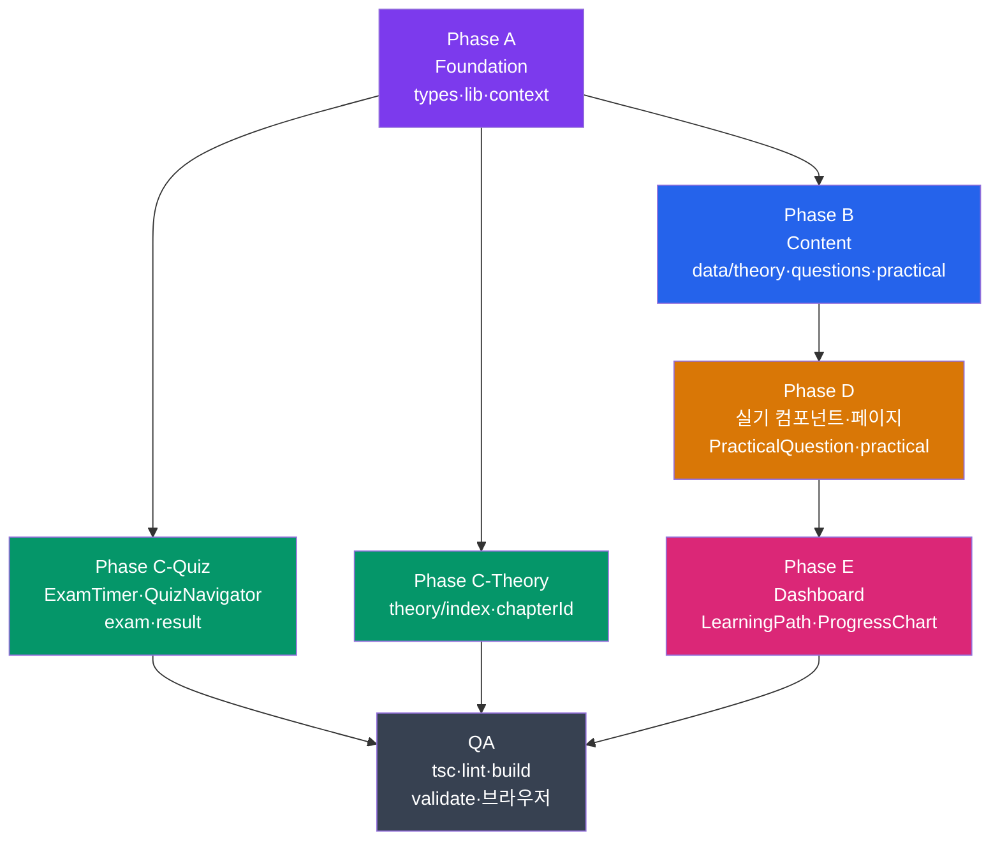

# 구현 계획서

| 항목 | 내용 |
|:---|:---|
| 사업명 | SQLP 시험 준비 웹 사이트 |
| 기술 스택 | Next.js 14 (Pages Router) · TypeScript · Tailwind CSS · localStorage |
| 렌더링 전략 | SSG (`getStaticPaths` + `getStaticProps`) + CSR (localStorage, 타이머) |
| 작성 일시 | 2026-06-04 |
| 버전 | v0.1 |

> **중요**: 이 프로젝트는 **Pages Router + SSG** 기반이다. App Router·RSC·Server Actions·Route Handlers를 사용하지 않는다. 데이터 뮤테이션은 전부 클라이언트 localStorage에서 발생한다.

---

## 1. 라우트 구조

### Pages Router 라우트 매핑

| SCR-ID | 화면명 | 라우트 경로 | 렌더링 방식 | 연계 UC |
|:---|:---|:---|:---:|:---|
| SCR-001 | 대시보드 홈 | `/` (`pages/index.tsx`) | SSG | UC-008 |
| SCR-002 | 이론 목차 | `/theory` (`pages/theory/index.tsx`) | SSG | UC-001 |
| SCR-003 | 이론 본문 | `/theory/[chapterId]` | **SSG (dynamic)** | UC-001 |
| SCR-004 | 문제풀이 메뉴 | `/quiz` (`pages/quiz/index.tsx`) | SSG | — |
| SCR-005 | 단원별 문제풀이 | `/quiz/chapter/[chapterId]` | **SSG (dynamic)** | UC-002 |
| SCR-006 | 전체 모의고사 | `/quiz/exam` (`pages/quiz/exam.tsx`) | SSG + CSR | UC-003 |
| SCR-007 | 모의고사 결과 | `/quiz/result` (`pages/quiz/result.tsx`) | CSR | UC-004 |
| SCR-008 | 오답 재풀이 | `/quiz/wrong` (`pages/quiz/wrong.tsx`) | CSR | UC-005 |
| SCR-009 | 북마크 문제풀이 | `/quiz/bookmarks` (`pages/quiz/bookmarks.tsx`) | CSR | UC-006 |
| SCR-010 | 실기 문제 목록 | `/quiz/practical` (`pages/quiz/practical.tsx`) | **SSG ★신규** | UC-007 |
| SCR-011 | 실기 상세 풀이 | `/practical/[practiceId]` | **SSG (dynamic) ★신규** | UC-007 |

### SSG 경로 생성 전략

**이론 본문 (`/theory/[chapterId]`)**:
```typescript
// pages/theory/[chapterId].tsx
export async function getStaticPaths() {
  const paths = CHAPTER_IDS.map((id) => ({ params: { chapterId: id } }))
  return { paths, fallback: false }  // 12개 경로 (BR-021, BR-022)
}
export async function getStaticProps({ params }) {
  const content = getChapterContent(params.chapterId)
  const meta = getChapterById(params.chapterId)
  return { props: { content, meta } }
}
```

**단원별 문제풀이 (`/quiz/chapter/[chapterId]`)**:
```typescript
// pages/quiz/chapter/[chapterId].tsx
export async function getStaticPaths() {
  const paths = CHAPTER_IDS.map((id) => ({ params: { chapterId: id } }))
  return { paths, fallback: false }  // 12개 경로
}
export async function getStaticProps({ params }) {
  const questions = getQuestionsByChapter(params.chapterId)
  return { props: { questions, chapterId: params.chapterId } }
}
```

**실기 상세 풀이 (`/practical/[practiceId]`) ★신규**:
```typescript
// pages/practical/[practiceId].tsx
export async function getStaticPaths() {
  const questions = getPracticalQuestions()
  const paths = questions.map((q) => ({ params: { practiceId: q.id } }))
  return { paths, fallback: false }
}
export async function getStaticProps({ params }) {
  const question = getPracticalQuestions().find((q) => q.id === params.practiceId)
  return { props: { question } }
}
```

---

## 2. SSG vs CSR 분류

| 라우트 | 방식 | 이유 |
|:---|:---:|:---|
| `/` | SSG | 정적 구조. localStorage는 CSR(`useEffect`)에서 로드 |
| `/theory` | SSG | 챕터 목록 정적 |
| `/theory/[chapterId]` | SSG | 마크다운 정적. TOC 스크롤 스파이는 CSR |
| `/quiz` | SSG | 메뉴 목록 정적 |
| `/quiz/chapter/[id]` | SSG | 문제 JSON 빌드 시 로드. 답변 처리는 CSR |
| `/quiz/exam` | SSG + CSR | 초기 렌더 SSG, 70문항 샘플링·타이머는 CSR `useEffect` |
| `/quiz/result` | CSR | localStorage에서 결과 로드. `router.query` 의존 |
| `/quiz/wrong` | CSR | localStorage `answers` 필터링 |
| `/quiz/bookmarks` | CSR | localStorage `bookmarks` 로드 |
| `/quiz/practical` | SSG | 실기 문제 목록 정적 로드 |
| `/practical/[practiceId]` | SSG | 지문 정적. SQL 입력·자기채점은 CSR |

---

## 3. Phase별 구현 계획

---

### Phase A — Foundation Builder (Agent 3)

> **목표**: 타입·유틸·상태 레이어를 SQLP 기준으로 교체. 이후 모든 Phase의 기반.

**검증 게이트**: `npx tsc --noEmit` 오류 0건 · `npm run test` 통과

#### A-1. `types/index.ts` 수정

| 변경 항목 | 내용 |
|:---|:---|
| `Question.part` | `1 \| 2` → **`1 \| 2 \| 3`** |
| `ChapterMeta.part` | `1 \| 2` → **`1 \| 2 \| 3`** |
| `ExamResult.part3Score` | `number` **신규 추가** |
| `ExamResult.practicalAnswers?` | `PracticalAnswer[]` **신규 추가** |
| `ProgressStore.practicalAnswers?` | `PracticalAnswer[]` **신규 추가** |
| `PracticalQuestion` | **인터페이스 신규** (`id`, `type`, `subType`, `content`, `sampleAnswer`, `scoringGuide`) |
| `PracticalAnswer` | **인터페이스 신규** (`questionId`, `userAnswer`, `selfScore: 0\|7\|15`) |

#### A-2. `lib/chapters.ts` 수정

```typescript
// CHAPTERS 배열에 Part 3 7챕터 추가
{ id: 'part3_ch1', part: 3, chapter: 1, title: 'SQL 수행 구조', idPrefix: 'p3c1_', questionCount: 0 },
{ id: 'part3_ch2', part: 3, chapter: 2, title: 'SQL 분석 도구', idPrefix: 'p3c2_', questionCount: 0 },
{ id: 'part3_ch3', part: 3, chapter: 3, title: '인덱스 튜닝', idPrefix: 'p3c3_', questionCount: 0 },
{ id: 'part3_ch4', part: 3, chapter: 4, title: '조인 튜닝', idPrefix: 'p3c4_', questionCount: 0 },
{ id: 'part3_ch5', part: 3, chapter: 5, title: 'SQL 옵티마이저', idPrefix: 'p3c5_', questionCount: 0 },
{ id: 'part3_ch6', part: 3, chapter: 6, title: '고급 SQL 튜닝', idPrefix: 'p3c6_', questionCount: 0 },
{ id: 'part3_ch7', part: 3, chapter: 7, title: 'Lock과 트랜잭션 동시성 제어', idPrefix: 'p3c7_', questionCount: 0 },
```

#### A-3. `lib/progress.ts` 수정

| 변경 항목 | 내용 |
|:---|:---|
| `STORAGE_KEY` | `'sqld_progress'` → **`'sqlp_progress'`** (BR-019) |
| `getStats().byPart` 초기화 | `{1:{},2:{}}` → **`{1:{},2:{},3:{}}`** |
| `savePracticalAnswer()` | **신규 함수** — `PracticalAnswer`를 `practicalAnswers` 배열에 upsert |

#### A-4. `lib/questions.ts` 수정

| 변경 항목 | 내용 |
|:---|:---|
| 전체 문제 로딩 | Part 3 JSON 7개 추가 (`part3_ch1~ch7`) |
| `sampleExamQuestions()` | P1:10 + P2:20 + **P3:40** = 70문항 (BR-003) |
| `getPracticalQuestions()` | **신규 함수** — `data/practical/questions.json` 로드 |

#### A-5. `context/ProgressContext.tsx` 수정

| 변경 항목 | 내용 |
|:---|:---|
| `savePracticalAnswer()` | **신규 메서드** — `ProgressLib.savePracticalAnswer()` 위임 |

---

### Phase B — Content Writer (Agent 2)

> **목표**: Part 3 이론·문제·실기 데이터 생성. 콘텐츠 레이어.

**검증 게이트**: `/validate-data` 스키마 오류 0건

#### B-1. 이론 마크다운 신규 생성 (7개)

```
data/theory/
  part3_ch1.md  — SQL 수행 구조 (DB 아키텍처·처리 과정·I/O)
  part3_ch2.md  — SQL 분석 도구 (실행계획·트레이스·응답시간)
  part3_ch3.md  — 인덱스 튜닝 (기본원리·액세스 최소화·스캔 효율화)
  part3_ch4.md  — 조인 튜닝 (NL·소트머지·해시·스칼라·고급조인)
  part3_ch5.md  — SQL 옵티마이저 (옵티마이징 원리·공유/재사용·쿼리 변환)
  part3_ch6.md  — 고급 SQL 튜닝 (소트·DML·DB Call·파티셔닝·배치)
  part3_ch7.md  — Lock과 트랜잭션 동시성 제어
```

형식: `# 3과목 N장: 제목` → `## 주요항목` → `### 세부항목` → `## 출제 포인트`

#### B-2. 문제 JSON 신규 생성 (7개)

```
data/questions/
  part3_ch1.json  목표 30문항  ID: p3c1_001 ~ p3c1_030
  part3_ch2.json  목표 20문항  ID: p3c2_001 ~ p3c2_020
  part3_ch3.json  목표 40문항  ID: p3c3_001 ~ p3c3_040
  part3_ch4.json  목표 40문항  ID: p3c4_001 ~ p3c4_040
  part3_ch5.json  목표 30문항  ID: p3c5_001 ~ p3c5_030
  part3_ch6.json  목표 40문항  ID: p3c6_001 ~ p3c6_040
  part3_ch7.json  목표 20문항  ID: p3c7_001 ~ p3c7_020
```

#### B-3. 실기 문제 JSON 신규 생성

```
data/practical/questions.json
  — sql-tuning subType 1~3 (각 2~3문제)
  — troubleshooting subType 1~2 (각 2~3문제)
  ID: practical_001 ~ practical_010 (예상)
```

#### B-4. 모의고사 JSON 재구성

```
data/mockexam/exam1.json  → 70문항 (P1:10 + P2:20 + P3:40)
data/mockexam/exam2.json  → 70문항 동일 구성
```

---

### Phase C — Quiz Builder (5) + Theory Builder (6) [병렬 실행 가능]

> **목표**: 기존 UI 페이지·컴포넌트를 SQLP 기준으로 수정.

**검증 게이트**: `npm run build` 성공 (12챕터 SSG 경로 생성)

#### C-1. Quiz Builder — 컴포넌트·페이지 수정

| 파일 | 변경 내용 |
|:---|:---|
| `components/quiz/ExamTimer.tsx` | 90분 → **180분**, 경고 임계 10분 → **20분** (BR-011~012) |
| `components/quiz/QuizNavigator.tsx` | 50문항 → **70문항** 그리드 레이아웃 |
| `pages/quiz/exam.tsx` | `sampleExamQuestions()` 호출로 70문항 구성. 과목별 섹션 구분 표시 |
| `pages/quiz/result.tsx` | `part3Score` 표시 추가. 합격 판정 로직 (BR-001·002) 구현 |

#### C-2. Theory Builder — 이론 페이지 수정

| 파일 | 변경 내용 |
|:---|:---|
| `pages/theory/index.tsx` | 12챕터를 1/2/3과목 섹션으로 그룹핑하여 표시 |
| `pages/theory/[chapterId].tsx` | `getStaticPaths`가 CHAPTERS 12개 ID 기반으로 경로 생성 (Part 3 포함) |

---

### Phase D — Quiz Builder (5)

> **목표**: 실기 연습 기능 신규 구현 (SCR-010, SCR-011).

**검증 게이트**: `/quiz/practical`, `/practical/[id]` 정상 렌더링

#### D-1. 신규 컴포넌트

**`components/quiz/PracticalQuestion.tsx`**
- Props: `question: PracticalQuestion`, `onSubmit: () => void`, `onScore: (score: 0|7|15) => void`
- 좌측: 지문 마크다운 렌더링 (`react-markdown`)
- 우측: SQL 작성 textarea (모노스페이스 폰트, `onChange` → `savePracticalAnswer`)
- 제출 버튼: 클릭 시 모범 답안 토글 버튼 활성화 (BR-015)
- 자기채점: 0·7·15점 버튼 3개 (BR-014)

#### D-2. 신규 페이지

**`pages/quiz/practical.tsx`** (SCR-010)
- `getStaticProps`: `getPracticalQuestions()` 로드
- `sql-tuning` / `troubleshooting` 섹션 구분 표시 (BR-017)
- 각 문제 카드 클릭 → `/practical/[practiceId]`

**`pages/practical/[practiceId].tsx`** (SCR-011)
- `getStaticPaths`: `getPracticalQuestions()` ID 기반 경로 생성
- `getStaticProps`: 해당 실기 문제 조회
- `PracticalQuestion` 컴포넌트 렌더링
- 답안 저장: `useContext(ProgressContext).savePracticalAnswer()` 호출 (BR-016)

---

### Phase E — Dashboard Builder (7)

> **목표**: 대시보드 3과목 체계 확장.

**검증 게이트**: `/` 페이지에서 3과목 통계 정상 표시

| 파일 | 변경 내용 |
|:---|:---|
| `components/dashboard/LearningPath.tsx` | 5챕터 → **12챕터** 버블. 3과목 섹션으로 그룹핑 |
| `components/dashboard/ProgressChart.tsx` | 2과목 → **3과목** 막대 차트 |
| `pages/index.tsx` | `stats.byPart[3]` 로 과목3 진도율 섹션 추가 |

---

### QA — QA Agent (8)

> **목표**: 전체 빌드 검증 및 브라우저 확인.

#### QA 검증 체크리스트

```bash
# Step 1: 타입 검사
npx tsc --noEmit
# → 오류 0건 확인

# Step 2: 린트
npm run lint
# → 오류 0건 확인

# Step 3: 빌드
npm run build
# → 생성 경로 확인:
#   /theory/part1_ch1 ~ /theory/part3_ch7  (12개)
#   /quiz/chapter/part1_ch1 ~ /quiz/chapter/part3_ch7  (12개)
#   /practical/practical_001 ~ ...  (실기 문제 수)

# Step 4: 데이터 검증
/validate-data
# → Part 3 JSON 7개 스키마 오류 0건

# Step 5: 개발 서버 브라우저 확인
npm run dev
```

#### 브라우저 확인 체크리스트

| 경로 | 확인 항목 |
|:---|:---|
| `/` | 3과목 진도율 차트, 12챕터 버블 표시 |
| `/theory` | 12챕터 3과목 그룹핑 목록 |
| `/theory/part3_ch1` | 이론 본문 렌더링, TOC 표시 |
| `/quiz/chapter/part3_ch1` | Part 3 문제 풀이, 즉시 피드백 |
| `/quiz/exam` | 70문항 구성, 180분 타이머 |
| `/quiz/result` | 3과목 점수 분리, 합격/불합격 |
| `/quiz/practical` | 실기 목록 2섹션 구분 |
| `/practical/practical_001` | 지문 표시, SQL 입력, 자기채점 |

---

## 4. 구현 의존 관계



---

## 5. 파일 변경/신규 요약

### 변경 파일 (기존)

| 파일 | Phase | 변경 내용 |
|:---|:---:|:---|
| `types/index.ts` | A | part:1\|2\|3, PracticalQuestion·Answer 신규, ExamResult·ProgressStore 확장 |
| `lib/chapters.ts` | A | CHAPTERS 12챕터 |
| `lib/progress.ts` | A | STORAGE_KEY, savePracticalAnswer, getStats 3과목 |
| `lib/questions.ts` | A | Part 3 로딩, 70문항 샘플링, getPracticalQuestions |
| `context/ProgressContext.tsx` | A | savePracticalAnswer |
| `components/quiz/ExamTimer.tsx` | C | 180분, 20분 경고 |
| `components/quiz/QuizNavigator.tsx` | C | 70문항 그리드 |
| `pages/quiz/exam.tsx` | C | 70문항, 3과목 섹션 |
| `pages/quiz/result.tsx` | C | 3과목 점수, 합격 판정 |
| `pages/theory/index.tsx` | C | 12챕터 3과목 그룹핑 |
| `pages/theory/[chapterId].tsx` | C | 12개 SSG 경로 |
| `data/mockexam/exam1.json` | B | 70문항 재구성 |
| `data/mockexam/exam2.json` | B | 70문항 재구성 |
| `components/dashboard/LearningPath.tsx` | E | 12챕터 버블 |
| `components/dashboard/ProgressChart.tsx` | E | 3과목 차트 |
| `pages/index.tsx` | E | 3과목 진도율 |

### 신규 파일

| 파일 | Phase | 내용 |
|:---|:---:|:---|
| `data/theory/part3_ch1~ch7.md` (7개) | B | Part 3 이론 마크다운 |
| `data/questions/part3_ch1~ch7.json` (7개) | B | Part 3 문제 JSON |
| `data/practical/questions.json` | B | 실기 문제 JSON |
| `components/quiz/PracticalQuestion.tsx` | D | 실기 UI 컴포넌트 |
| `pages/quiz/practical.tsx` | D | 실기 목록 (SCR-010) |
| `pages/practical/[practiceId].tsx` | D | 실기 상세 (SCR-011) |

---

## 문서 버전 이력

| 버전 | 일자 | 작성자 | 변경 내용 |
|:---|:---|:---|:---|
| v0.1 | 2026-06-04 | 초안 작성 | ai-dlc-nxt-impl-plan 스킬로 최초 생성. Pages Router + SSG 기반. Phase A~E + QA 구현 계획 수립 |
