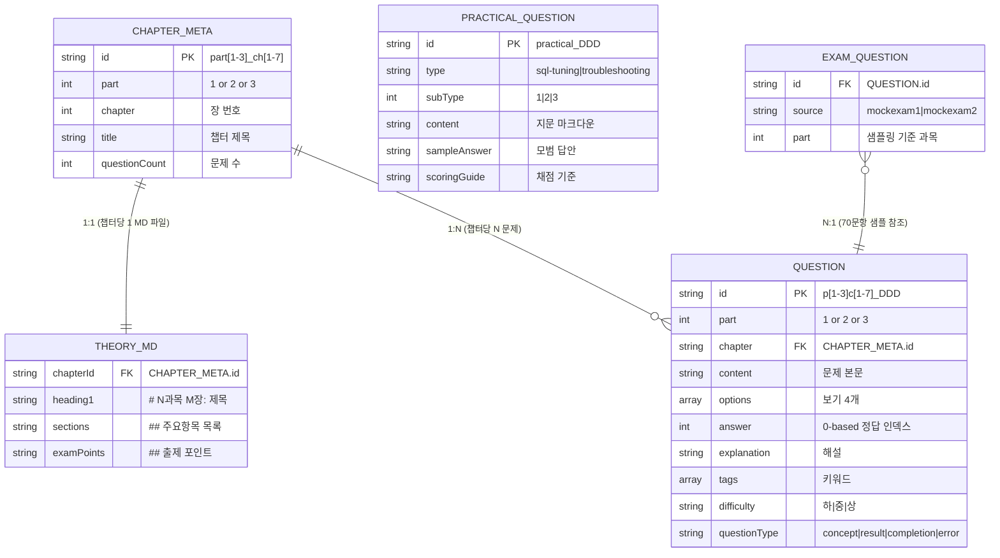

# 데이터 설계서

| 항목 | 내용 |
|:---|:---|
| 사업명 | SQLP 시험 준비 웹 사이트 |
| 데이터 저장 방식 | 파일 기반 (JSON + Markdown) — DB 없음 |
| 파일 종류 | 4종 (이론MD·객관식JSON·실기JSON·모의고사JSON) |
| 작성 일시 | 2026-06-04 |
| 버전 | v0.1 |

> **DB 미사용 프로젝트**: 서버리스 정적 사이트로 RDBMS를 사용하지 않는다. 데이터는 Git으로 버전 관리되는 파일로 존재하며, 런타임 진도 데이터는 브라우저 localStorage에 저장된다.

---

## 1. 데이터 파일 목록

| 파일 유형 | 경로 패턴 | 파일 수 | 설명 | 연계 UC |
|:---|:---|:---:|:---|:---|
| 이론 마크다운 | `data/theory/part{N}_ch{M}.md` | 12개 (기존 5 + 신규 7) | 챕터별 이론 콘텐츠 | UC-001 |
| 객관식 문제 JSON | `data/questions/part{N}_ch{M}.json` | 12개 (기존 5 + 신규 7) | 챕터별 4지선다 문제 배열 | UC-002~006 |
| 실기 문제 JSON | `data/practical/questions.json` | 1개 (신규) | SQL 튜닝·성능 트러블슈팅 실기 문제 | UC-007 |
| 모의고사 JSON | `data/mockexam/exam{N}.json` | 2개 (70문항 재구성) | 전체 모의고사용 70문항 | UC-003 |
| 진도 localStorage | `sqlp_progress` (브라우저 키) | — | 런타임 학습 진도 저장 | UC-002~008 |

---

## 2. 데이터 구조 관계도



---

## 3. 데이터 파일별 상세 스키마

---

### 3-1. 이론 마크다운 (`data/theory/part3_ch*.md`)

#### 신규 생성 대상 (7개)

| 파일명 | 챕터 | 주요 항목 |
|:---|:---|:---|
| `part3_ch1.md` | SQL 수행 구조 | DB 아키텍처, SQL 처리 과정, DB I/O 메커니즘 |
| `part3_ch2.md` | SQL 분석 도구 | 예상 실행계획, SQL 트레이스, 응답 시간 분석 |
| `part3_ch3.md` | 인덱스 튜닝 | 기본 원리, 테이블 액세스 최소화, 스캔 효율화, 인덱스 설계 |
| `part3_ch4.md` | 조인 튜닝 | NL 조인, 소트 머지 조인, 해시 조인, 스칼라 서브쿼리, 고급 조인 |
| `part3_ch5.md` | SQL 옵티마이저 | 옵티마이징 원리, SQL 공유/재사용, 쿼리 변환 |
| `part3_ch6.md` | 고급 SQL 튜닝 | 소트 튜닝, DML 튜닝, DB Call 최소화, 파티셔닝, 배치 프로그램 |
| `part3_ch7.md` | Lock과 트랜잭션 | Lock, 트랜잭션, 동시성 제어 |

#### 마크다운 구조 템플릿

```markdown
# 3과목 {M}장: {챕터 제목}

## 1. {주요항목1}

### {세부항목1-1}
{내용 — 불릿, 표, 코드 블록 포함}

### {세부항목1-2}
...

## 2. {주요항목2}
...

## 출제 포인트

- {SQLP 시험에서 자주 출제되는 핵심 개념 요약}
- {실기 문제와 연결되는 튜닝 포인트}
```

#### 헤딩 레벨 규칙

| 헤딩 | 용도 | TheoryTOC 추출 |
|:---|:---|:---:|
| `#` | 챕터 제목 (`3과목 N장: 제목`) | ❌ (제외) |
| `##` | 주요항목 (번호 포함 권장) | ✅ (목차 항목) |
| `###` | 세부항목 | ❌ (제외) |

---

### 3-2. 객관식 문제 JSON (`data/questions/part3_ch*.json`)

#### JSON 스키마 (TypeScript 인터페이스 기반)

```typescript
// Question 인터페이스 (CLS-001 기반)
interface Question {
  id: string           // 필수: "p3c{M}_{DDD}" 형식 (예: p3c1_001)
  part: 3              // 필수: 상수 3 (3과목)
  chapter: string      // 필수: "part3_ch{M}" 형식 (예: part3_ch1)
  content: string      // 필수: 문제 본문 (마크다운 지원, SQL 코드 블록 포함 가능)
  options: string[]    // 필수: 정확히 4개 요소
  answer: number       // 필수: 0-based 인덱스 (0~3)
  explanation: string  // 필수: 상세 해설
  tags?: string[]      // 선택: 키워드 (예: ["NL조인", "해시조인"])
  difficulty?: '하' | '중' | '상'   // 선택: 권장 비율 하20%·중55%·상25%
  questionType?: 'concept' | 'result' | 'completion' | 'error'  // 선택
}
```

#### 챕터별 문제 목표 수

| 파일명 | 챕터 | 목표 문항 | ID 범위 | 비고 |
|:---|:---|:---:|:---|:---|
| `part3_ch1.json` | SQL 수행 구조 | 30문항 | p3c1_001~030 | |
| `part3_ch2.json` | SQL 분석 도구 | 20문항 | p3c2_001~020 | |
| `part3_ch3.json` | 인덱스 튜닝 | 40문항 | p3c3_001~040 | 핵심 챕터 |
| `part3_ch4.json` | 조인 튜닝 | 40문항 | p3c4_001~040 | 핵심 챕터 |
| `part3_ch5.json` | SQL 옵티마이저 | 30문항 | p3c5_001~030 | |
| `part3_ch6.json` | 고급 SQL 튜닝 | 40문항 | p3c6_001~040 | 핵심 챕터 |
| `part3_ch7.json` | Lock과 트랜잭션 | 20문항 | p3c7_001~020 | |
| **합계** | — | **220문항** | — | Part 3 전체 목표 |

#### 예시 레코드

```json
[
  {
    "id": "p3c3_001",
    "part": 3,
    "chapter": "part3_ch3",
    "content": "다음 중 인덱스 Range Scan이 발생하지 않는 조건은?",
    "options": [
      "WHERE col BETWEEN 100 AND 200",
      "WHERE col LIKE 'ABC%'",
      "WHERE col LIKE '%ABC'",
      "WHERE col >= 100 AND col <= 200"
    ],
    "answer": 2,
    "explanation": "LIKE '%ABC'와 같이 선두에 와일드카드(%)가 있는 경우 인덱스를 통한 Range Scan이 불가능하며 Full Table Scan이 발생한다. 나머지 조건들은 모두 인덱스 Range Scan이 가능하다.",
    "tags": ["인덱스", "Range Scan", "LIKE"],
    "difficulty": "중",
    "questionType": "concept"
  }
]
```

#### 유효성 검사 규칙

| 항목 | 규칙 |
|:---|:---|
| id 형식 | `^p3c[1-7]_\d{3}$` |
| part 값 | 반드시 `3` |
| chapter 형식 | `^part3_ch[1-7]$` |
| options 길이 | 정확히 4개 |
| answer 범위 | 0 이상 3 이하 정수 |
| difficulty | `하`, `중`, `상` 중 하나 |

---

### 3-3. 실기 문제 JSON (`data/practical/questions.json`)

#### JSON 스키마 (PracticalQuestion 인터페이스 기반)

```typescript
// PracticalQuestion 인터페이스 (CLS-002 기반)
interface PracticalQuestion {
  id: string                               // 필수: "practical_DDD" (예: practical_001)
  type: 'sql-tuning' | 'troubleshooting'  // 필수: 실기 유형
  subType: 1 | 2 | 3                      // 필수: 유형 내 세부 번호
  content: string                          // 필수: 지문 전체 (마크다운)
  sampleAnswer: string                     // 필수: 모범 답안 SQL + 설명
  scoringGuide: string                     // 필수: 채점 기준 및 배점 포인트
}
```

#### 실기 유형 분류

| type | subType | 유형명 | 설명 |
|:---|:---:|:---|:---|
| `sql-tuning` | 1 | SQL 튜닝 유형1 | 성능 저하 SQL + 실행계획 분석 → 개선 SQL 작성 |
| `sql-tuning` | 2 | SQL 튜닝 유형2 | 요구사항 + 최적 실행계획 → SQL 작성 |
| `sql-tuning` | 3 | SQL 튜닝 유형3 | 요구사항 + 데이터 모델 → 최적 SQL 작성 |
| `troubleshooting` | 1 | 트러블슈팅 유형1 | 성능 저하 애플리케이션 분석 → 개선안 작성 |
| `troubleshooting` | 2 | 트러블슈팅 유형2 | 성능 이슈 원인 분석 및 개선 방안 제시 |

#### 문제 구성 목표

| type | subType | 목표 문제 수 | ID 범위 |
|:---|:---:|:---:|:---|
| `sql-tuning` | 1 | 3문제 | practical_001~003 |
| `sql-tuning` | 2 | 3문제 | practical_004~006 |
| `sql-tuning` | 3 | 2문제 | practical_007~008 |
| `troubleshooting` | 1 | 2문제 | practical_009~010 |
| `troubleshooting` | 2 | 2문제 | practical_011~012 |
| **합계** | — | **12문제** | practical_001~012 |

#### 예시 레코드

```json
[
  {
    "id": "practical_001",
    "type": "sql-tuning",
    "subType": 1,
    "content": "## 문제\n\n다음 SQL은 주문 테이블에서 최근 30일간 주문을 조회하는 쿼리이다.\n\n```sql\nSELECT * FROM TB_ORDER\nWHERE TO_CHAR(ORDER_DT, 'YYYYMMDD') >= TO_CHAR(SYSDATE-30, 'YYYYMMDD')\n```\n\n### 인덱스 현황\n- TB_ORDER: ORDER_DT 컬럼에 인덱스 존재 (IDX_ORDER_01)\n\n### 현재 실행계획\n```\nTABLE ACCESS FULL TB_ORDER\n```\n\n위 SQL의 성능 문제를 분석하고 개선된 SQL을 작성하시오.",
    "sampleAnswer": "### 문제 원인\n`TO_CHAR(ORDER_DT, 'YYYYMMDD')` 형태로 인덱스 컬럼에 함수를 적용하여 인덱스가 사용되지 않음 (Full Table Scan 발생).\n\n### 개선 SQL\n```sql\nSELECT * FROM TB_ORDER\nWHERE ORDER_DT >= TRUNC(SYSDATE) - 30\n  AND ORDER_DT < TRUNC(SYSDATE) + 1\n```\n\n### 개선 설명\n- 인덱스 컬럼(ORDER_DT)에 함수 미적용으로 인덱스 Range Scan 가능\n- 날짜 범위 조건을 BETWEEN 대신 >= AND < 형식으로 명시",
    "scoringGuide": "- 성능 저하 원인 분석 (5점): 함수 적용으로 인한 인덱스 미사용 명시\n- 개선 SQL 작성 (7점): 인덱스 컬럼에 함수 미적용, 동등한 결과 보장\n- 개선 효과 설명 (3점): Range Scan 활용 명시"
  }
]
```

#### content 마크다운 작성 규칙

| 섹션 | 헤딩 | 필수 여부 |
|:---|:---:|:---:|
| 문제 | `## 문제` | ✅ |
| 테이블/인덱스 정보 | `### 테이블 구조`, `### 인덱스 현황` | 유형에 따라 |
| 현재 실행계획 | `### 현재 실행계획` | 유형1·2 |
| 요구사항 | `### 요구사항` | 유형2·3 |
| 데이터 모델 | `### 데이터 모델` | 유형3 |

---

### 3-4. 모의고사 JSON (`data/mockexam/exam*.json`)

#### 파일 구조

모의고사 JSON은 `Question` 객체 배열 그대로 70개를 담는다.
구성 비율: **1과목 10문항 + 2과목 20문항 + 3과목 40문항**

```typescript
// 모의고사 파일 = Question[] 그대로 사용 (별도 래퍼 없음)
type MockExam = Question[]

// 구성 조건
const mockExamConfig = {
  part1: { count: 10, maxScore: 10 },
  part2: { count: 20, maxScore: 20 },
  part3: { count: 40, maxScore: 40 },
  total: 70
}
```

#### 예시 구조

```json
[
  { "id": "p1c1_001", "part": 1, "chapter": "part1_ch1", ... },
  { "id": "p1c1_005", "part": 1, "chapter": "part1_ch1", ... },
  ...
  { "id": "p2c1_001", "part": 2, "chapter": "part2_ch1", ... },
  ...
  { "id": "p3c3_001", "part": 3, "chapter": "part3_ch3", ... },
  ...
]
```

#### 구성 규칙

| 과목 | 문항 수 | 챕터 분배 | ID 예시 |
|:---|:---:|:---|:---|
| 1과목 | 10 | part1_ch1(5~6) + part1_ch2(4~5) | p1c1_*, p1c2_* |
| 2과목 | 20 | part2_ch1(8~10) + part2_ch2(7~8) + part2_ch3(3~5) | p2c1_*, p2c2_*, p2c3_* |
| 3과목 | 40 | part3_ch1(4~5) + ch2(3~4) + ch3(7~8) + ch4(7~8) + ch5(4~5) + ch6(7~8) + ch7(3~4) | p3c*_* |

---

## 4. 데이터 간 참조 관계

| 소스 파일 | 참조 대상 | 참조 방식 | 설명 |
|:---|:---|:---:|:---|
| `data/questions/part{N}_ch{M}.json` | `lib/chapters.ts`.CHAPTERS | 파일 경로 매핑 | `part` + `chapter` 필드 → 챕터 ID |
| `data/mockexam/exam*.json` | `data/questions/` | ID 교차 참조 | 모의고사 문항은 챕터 JSON에서 복사 |
| `data/practical/questions.json` | `pages/practical/[practiceId].tsx` | SSG 경로 | `id` → URL 파라미터 |
| `data/theory/part{N}_ch{M}.md` | `lib/chapters.ts`.CHAPTERS | 파일명 매핑 | 챕터 ID == 마크다운 파일명 |

---

## 5. 공통 코드 정의

### 문제 난이도 코드

| 코드값 | 코드명 | 비율 (권장) | 설명 |
|:---:|:---|:---:|:---|
| `하` | 하 (기본) | 20% | 개념 이해 수준 |
| `중` | 중 (표준) | 55% | 응용 적용 수준 |
| `상` | 상 (심화) | 25% | 복합 분석 수준 |

### 문제 유형 코드

| 코드값 | 코드명 | 설명 |
|:---:|:---|:---|
| `concept` | 개념형 | 개념·정의·특징을 묻는 문제 |
| `result` | 결과형 | SQL 실행 결과를 예측하는 문제 |
| `completion` | 완성형 | 빈칸을 채우는 문제 |
| `error` | 오류형 | 잘못된 것을 찾는 문제 |

### 실기 유형 코드

| type | subType | 유형명 |
|:---|:---:|:---|
| `sql-tuning` | 1 | 성능 저하 SQL 개선 |
| `sql-tuning` | 2 | 실행계획 기반 SQL 작성 |
| `sql-tuning` | 3 | 데이터 모델 기반 최적 SQL |
| `troubleshooting` | 1 | 애플리케이션 성능 개선 |
| `troubleshooting` | 2 | 성능 이슈 원인 분석 |

---

## 6. 데이터 표준 및 명명 규칙

### 파일 명명 규칙

| 파일 유형 | 패턴 | 예시 |
|:---|:---|:---|
| 이론 마크다운 | `data/theory/part{N}_ch{M}.md` | `part3_ch1.md` |
| 객관식 문제 | `data/questions/part{N}_ch{M}.json` | `part3_ch3.json` |
| 실기 문제 | `data/practical/questions.json` | (고정) |
| 모의고사 | `data/mockexam/exam{N}.json` | `exam1.json` |

### ID 채번 규칙

| 종류 | 형식 | 예시 | 비고 |
|:---|:---|:---|:---|
| 이론 챕터 | `part[1-3]_ch[1-7]` | `part3_ch3` | 파일명과 동일 |
| 객관식 문제 | `p[1-3]c[1-7]_\d{3}` | `p3c3_001` | 챕터별 001부터 순차 |
| 실기 문제 | `practical_\d{3}` | `practical_001` | 전체 001부터 순차 |
| 모의고사 문제 | 챕터 문제 ID 그대로 | `p3c3_001` | 별도 채번 없음 |

### 콘텐츠 작성 기준

| 항목 | 기준 |
|:---|:---|
| 이론 MD 분량 | 챕터당 300~600줄 (시험 범위 충분 포함) |
| SQL 코드 블록 | 반드시 ` ```sql ` 코드 펜스 사용 |
| 출제 포인트 | 5~10개 항목, 실제 시험 출제 경향 반영 |
| 문제 본문 길이 | 1~5줄 (간결하게), SQL 포함 시 코드 블록 사용 |
| 해설 길이 | 2~5줄, 오답 이유 포함 권장 |
| 실기 지문 분량 | A4 1~2장 분량 (마크다운 200~400자) |

---

## 7. 데이터 검증 규칙 (validate-questions.ts)

```typescript
// 검증 항목 (scripts/validate-questions.ts)
const validationRules = {
  // 객관식 문제 검증
  question: {
    id: /^p[1-3]c[1-7]_\d{3}$/,
    partRange: [1, 2, 3],
    optionsLength: 4,
    answerRange: [0, 1, 2, 3],
    requiredFields: ['id', 'part', 'chapter', 'content', 'options', 'answer', 'explanation'],
    difficultyValues: ['하', '중', '상'],
  },
  // 실기 문제 검증
  practicalQuestion: {
    id: /^practical_\d{3}$/,
    typeValues: ['sql-tuning', 'troubleshooting'],
    subTypeRange: [1, 2, 3],
    requiredFields: ['id', 'type', 'subType', 'content', 'sampleAnswer', 'scoringGuide'],
  },
  // 챕터 문제 수 검증
  chapterCounts: {
    part3_ch1: { min: 25, target: 30 },
    part3_ch2: { min: 15, target: 20 },
    part3_ch3: { min: 35, target: 40 },
    part3_ch4: { min: 35, target: 40 },
    part3_ch5: { min: 25, target: 30 },
    part3_ch6: { min: 35, target: 40 },
    part3_ch7: { min: 15, target: 20 },
  }
}
```

---

## 문서 버전 이력

| 버전 | 일자 | 작성자 | 변경 내용 |
|:---|:---|:---|:---|
| v0.1 | 2026-06-04 | 초안 작성 | ai-dlc-data-design 스킬로 최초 생성. DB 없는 파일 기반 스키마 설계. 이론MD·객관식JSON·실기JSON·모의고사JSON 4종 정의 |
