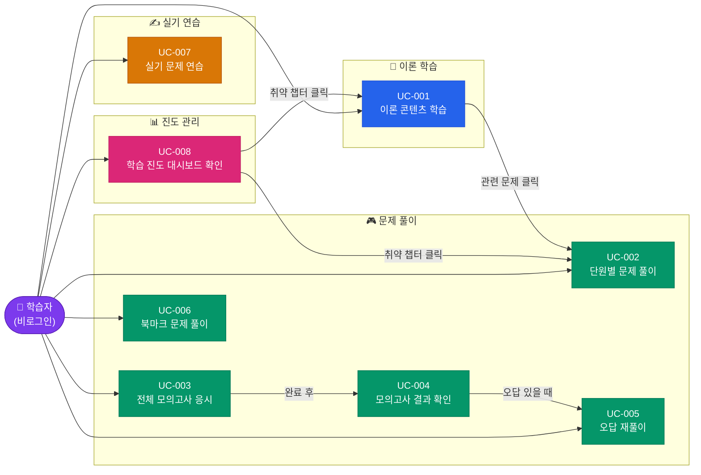

# 유즈케이스 문서

| 항목 | 내용 |
|:---|:---|
| 사업명 | SQLP 시험 준비 웹 사이트 |
| 분석 범위 | FR-001~FR-023 전체 (23건) |
| UC 총 건수 | 8건 |
| FR 연계 건수 | 23건 (100%) |
| 작성 일시 | 2026-06-04 |
| 버전 | v0.1 |

---

## 1. 액터 목록

| 액터명 | 유형 | 역할 설명 | 관련 UC |
|:---|:---:|:---|:---|
| 학습자 | 사람 | SQLP 시험 준비 학습자. 로그인 불필요. 브라우저 localStorage로 진도 관리 | UC-001 ~ UC-008 전체 |
| 시스템 | 시스템 | Next.js SSG 기반 웹 앱. localStorage 읽기·쓰기, 점수 계산, 타이머 동작 | (모든 UC에서 대응) |

---

## 2. 유즈케이스 목록

| UC-ID | 유즈케이스명 | 주요 액터 | 연관 FR | 연관 SCR | 우선순위 |
|:---|:---|:---|:---|:---|:---:|
| UC-001 | 이론 콘텐츠 학습 | 학습자 | FR-001~004 | SCR-002, SCR-003 | 1 |
| UC-002 | 단원별 문제 풀이 | 학습자 | FR-005~007, FR-013, FR-019 | SCR-004, SCR-005 | 1 |
| UC-003 | 전체 모의고사 응시 | 학습자 | FR-008~009, FR-019 | SCR-006 | 1 |
| UC-004 | 모의고사 결과 확인 | 학습자 | FR-010 | SCR-007 | 1 |
| UC-005 | 오답 재풀이 | 학습자 | FR-011, FR-019 | SCR-008 | 2 |
| UC-006 | 북마크 문제 풀이 | 학습자 | FR-012, FR-019 | SCR-009 | 2 |
| UC-007 | 실기 문제 연습 | 학습자 | FR-014~018, FR-019 | SCR-010, SCR-011 | 1 |
| UC-008 | 학습 진도 대시보드 확인 | 학습자 | FR-019~023 | SCR-001 | 1 |

---

## 3. 유즈케이스 상세

---

### UC-001: 이론 콘텐츠 학습

| 항목 | 내용 |
|:---|:---|
| 액터 | 학습자 |
| 사전 조건 | 학습자가 브라우저에서 사이트에 접속 |
| 사후 조건 | 이론 본문 열람 완료. 필요 시 관련 문제로 이동 |
| 연관 FR | FR-001(이론표시), FR-002(TOC), FR-003(하이라이팅), FR-004(관련문제) |
| 연관 BR | BR-020(TOC 헤딩 추출), BR-021(SSG 경로 소스), BR-022(챕터 ID 형식) |

**기본 흐름 (주요 성공 시나리오)**

| 단계 | 액터/시스템 | 처리 내용 |
|:---:|:---:|:---|
| 1 | 학습자 | GNB "이론 학습" 클릭 → SCR-002(이론 목차) 이동 |
| 2 | 시스템 | 12챕터 목록을 1/2/3과목으로 그룹핑하여 표시 |
| 3 | 학습자 | 학습할 챕터 클릭 → SCR-003(이론 본문) 이동 |
| 4 | 시스템 | 마크다운 이론 본문 렌더링. ## 헤딩 기반 TOC 자동 생성(BR-020), SQL 코드 하이라이팅 적용 |
| 5 | 학습자 | TOC 항목 클릭으로 원하는 섹션으로 스크롤 이동 |
| 6 | 시스템 | 우측에 챕터 관련 문제 2~3개 미리보기 표시 (FR-004) |
| 7 | 학습자 | 이론 학습 완료 후 다음 챕터 또는 문제 풀이로 이동 |

**대안 흐름**

- **A1 (관련 문제 바로 풀기)**: 6단계에서 관련 문제 미리보기 클릭 → UC-002(단원별 문제 풀이) 진입

**예외 흐름**

| 예외 조건 | 처리 내용 |
|:---|:---|
| 존재하지 않는 챕터 ID로 직접 URL 접근 | Next.js `fallback: false` 설정으로 404 페이지 반환 (BR-022) |
| 마크다운 파일 없음 | 빈 본문 또는 "준비 중" 메시지 표시 |

---

### UC-002: 단원별 문제 풀이

| 항목 | 내용 |
|:---|:---|
| 액터 | 학습자 |
| 사전 조건 | 학습자가 풀이할 챕터를 선택 |
| 사후 조건 | 문제별 정답/오답 결과가 `sqlp_progress.answers`에 저장 |
| 연관 FR | FR-005~007(풀이/피드백/해설), FR-013(북마크), FR-019(진도 기록) |
| 연관 BR | BR-005(즉시피드백), BR-006(해설공개), BR-008(북마크토글), BR-009(ID형식), BR-018(SSR가드), BR-019(단일키) |

**기본 흐름 (주요 성공 시나리오)**

| 단계 | 액터/시스템 | 처리 내용 |
|:---:|:---:|:---|
| 1 | 학습자 | GNB "문제풀이" → SCR-004(메뉴) → 챕터 선택 → SCR-005 이동 |
| 2 | 시스템 | 선택된 챕터 JSON 로드 → 첫 번째 문제와 4지선다 보기 표시 |
| 3 | 학습자 | 보기 클릭으로 답안 선택 |
| 4 | 시스템 | 즉시 정답(초록)/오답(빨강) 피드백 표시(BR-005), 해설 영역 공개(BR-006) |
| 5 | 시스템 | 결과를 `sqlp_progress.answers`에 저장 (BR-018, BR-019) |
| 6 | 학습자 | (선택) 북마크 버튼 클릭 |
| 7 | 시스템 | 북마크 토글 처리: 미등록이면 추가, 등록이면 제거 (BR-008) |
| 8 | 학습자 | 다음 문제 버튼 클릭 → 2~7단계 반복 |
| 9 | 시스템 | 마지막 문제 완료 시 챕터 완료 메시지 및 정답률 표시 |

**대안 흐름**

- **A1 (특정 문제 건너뛰기)**: 3단계에서 답 선택 없이 다음 문제로 이동 → 'skipped' 처리

**예외 흐름**

| 예외 조건 | 처리 내용 |
|:---|:---|
| 해당 챕터 문제 JSON이 없거나 비어있음 | "이 챕터는 아직 문제가 준비 중입니다" 메시지 표시 |

---

### UC-003: 전체 모의고사 응시

| 항목 | 내용 |
|:---|:---|
| 액터 | 학습자 |
| 사전 조건 | 학습자가 모의고사 응시를 결정 |
| 사후 조건 | 70문항 답안 제출 완료. `examHistory`에 ExamResult 저장 |
| 연관 FR | FR-008(모의고사), FR-009(타이머 180분), FR-019(진도 기록) |
| 연관 BR | BR-003(문항구성비율), BR-011(타이머시작), BR-012(타이머경고), BR-013(자동제출) |

**기본 흐름 (주요 성공 시나리오)**

| 단계 | 액터/시스템 | 처리 내용 |
|:---:|:---:|:---|
| 1 | 학습자 | GNB "문제풀이" → SCR-004 → "전체 모의고사" 클릭 → SCR-006 이동 |
| 2 | 시스템 | 1과목 10 + 2과목 20 + 3과목 40 = 70문항 무작위 선정 (BR-003) |
| 3 | 시스템 | 180분 카운트다운 타이머 시작 (BR-011) |
| 4 | 학습자 | QuizNavigator(70문항 그리드)로 문항 이동하며 답안 선택 |
| 5 | 시스템 | 선택 답안 임시 저장 (제출 전 정답/오답 피드백 미표시) |
| 6 | 학습자 | 전체 풀이 완료 후 "제출" 클릭 → SCR-007 이동 (UC-004 연결) |

**대안 흐름**

- **A1 (타이머 20분 이하)**: 5단계 중 잔여 ≤ 20분이면 타이머 빨간색 경고 표시 (BR-012)

**예외 흐름**

| 예외 조건 | 처리 내용 |
|:---|:---|
| 타이머 0 도달 (시간 초과) | 현재 답안 상태로 자동 제출, 미응답은 'skipped' 처리, SCR-007 이동 (BR-013) |

---

### UC-004: 모의고사 결과 확인

| 항목 | 내용 |
|:---|:---|
| 액터 | 학습자 |
| 사전 조건 | UC-003(전체 모의고사 응시) 완료 후 SCR-007 진입 |
| 사후 조건 | 합격/불합격 확인. ExamResult가 `sqlp_progress.examHistory`에 저장 |
| 연관 FR | FR-010(결과표시 3과목) |
| 연관 BR | BR-001(합격전체점수), BR-002(합격과목최소점수), BR-004(실기배점) |

**기본 흐름 (주요 성공 시나리오)**

| 단계 | 액터/시스템 | 처리 내용 |
|:---:|:---:|:---|
| 1 | 시스템 | 1과목·2과목·3과목 점수 분리 계산·표시 |
| 2 | 시스템 | 합격 판정: 전체 ≥60점 AND 과락 없음 → "합격" / 조건 미달 → "불합격" (BR-001, BR-002) |
| 3 | 학습자 | 과목별 정답률, 취약 문항 확인 |
| 4 | 학습자 | (선택) 오답 재풀이 시작 → UC-005 진입 |
| 5 | 학습자 | (선택) 홈으로 이동 → UCM-008 진입 |

**대안 흐름**

- **A1 (과락 과목 있음)**: 2단계에서 과락 과목 별도 강조 표시 후 복습 권장

**예외 흐름**

| 예외 조건 | 처리 내용 |
|:---|:---|
| 결과 데이터 없이 직접 URL 접근 | 홈("/")으로 리다이렉트 |

---

### UC-005: 오답 재풀이

| 항목 | 내용 |
|:---|:---|
| 액터 | 학습자 |
| 사전 조건 | `sqlp_progress.answers`에 'wrong' 상태 문제가 1개 이상 존재 |
| 사후 조건 | 재도전 결과로 answers 업데이트 |
| 연관 FR | FR-011(오답재풀이), FR-019(진도 기록) |
| 연관 BR | BR-007(오답재풀이 필터), BR-005(즉시피드백), BR-006(해설공개) |

**기본 흐름 (주요 성공 시나리오)**

| 단계 | 액터/시스템 | 처리 내용 |
|:---:|:---:|:---|
| 1 | 학습자 | GNB "문제풀이" → SCR-004 → "오답 재풀이" → SCR-008 이동 |
| 2 | 시스템 | `answers` 중 상태 `'wrong'`인 문제 ID 필터링, 해당 문제 출제 (BR-007) |
| 3 | 학습자 | 문제 풀이 (UC-002의 3~5단계와 동일) |
| 4 | 시스템 | 정답 선택 시 해당 문제 상태 'correct'로 업데이트 |

**대안 흐름** — 해당 없음

**예외 흐름**

| 예외 조건 | 처리 내용 |
|:---|:---|
| 오답 문제가 없음 | "오답 문제가 없습니다. 계속 학습해 보세요!" 메시지 표시 |

---

### UC-006: 북마크 문제 풀이

| 항목 | 내용 |
|:---|:---|
| 액터 | 학습자 |
| 사전 조건 | `sqlp_progress.bookmarks` 배열에 북마크된 문제가 1개 이상 존재 |
| 사후 조건 | 북마크 문제 풀이 결과로 answers 업데이트 |
| 연관 FR | FR-012(북마크풀이), FR-019(진도 기록) |
| 연관 BR | BR-008(북마크토글), BR-005, BR-006 |

**기본 흐름 (주요 성공 시나리오)**

| 단계 | 액터/시스템 | 처리 내용 |
|:---:|:---:|:---|
| 1 | 학습자 | GNB "문제풀이" → SCR-004 → "북마크 풀이" → SCR-009 이동 |
| 2 | 시스템 | `bookmarks` 배열 기반 문제 로드, 순서대로 출제 |
| 3 | 학습자 | 문제 풀이 (UC-002의 3~5단계와 동일) |
| 4 | 학습자 | (선택) 북마크 해제 클릭 → 해당 문제 bookmarks에서 제거 (BR-008) |

**대안 흐름** — 해당 없음

**예외 흐름**

| 예외 조건 | 처리 내용 |
|:---|:---|
| 북마크된 문제 없음 | "북마크된 문제가 없습니다. 문제 풀이 중 북마크를 추가해 보세요!" 메시지 표시 |

---

### UC-007: 실기 문제 연습

| 항목 | 내용 |
|:---|:---|
| 액터 | 학습자 |
| 사전 조건 | 없음 (비로그인, 인증 불필요) |
| 사후 조건 | SQL 답안과 자기채점 결과가 `practicalAnswers`에 저장 |
| 연관 FR | FR-014(목록), FR-015(지문), FR-016(SQL입력), FR-017(모범답안), FR-018(자기채점), FR-019(저장) |
| 연관 BR | BR-014(자기채점값), BR-015(모범답안공개), BR-016(답안저장), BR-017(문제분류) |

**기본 흐름 (주요 성공 시나리오)**

| 단계 | 액터/시스템 | 처리 내용 |
|:---:|:---:|:---|
| 1 | 학습자 | GNB "실기 연습" → SCR-010(실기 목록) 이동 |
| 2 | 시스템 | SQL 튜닝(3유형)과 성능 트러블슈팅(2유형) 섹션 구분 표시 (BR-017) |
| 3 | 학습자 | 원하는 실기 문제 클릭 → SCR-011(실기 상세 풀이) 이동 |
| 4 | 시스템 | 좌측: 지문 마크다운 렌더링. 우측: SQL 작성 텍스트에어리어 표시 |
| 5 | 학습자 | SQL 답안 작성 |
| 6 | 시스템 | 입력 내용 실시간 localStorage 저장 (BR-016) |
| 7 | 학습자 | "제출" 버튼 클릭 |
| 8 | 시스템 | 모범 답안 토글 버튼 활성화 (BR-015) |
| 9 | 학습자 | 모범 답안 확인 후 자기채점 클릭: 0점 / 7점 / 15점 선택 (BR-014) |
| 10 | 시스템 | `selfScore` 저장, 채점 완료 표시 |

**대안 흐름**

- **A1 (모범 답안 공개/숨김 토글)**: 8단계 이후 학습자가 모범 답안을 반복적으로 공개/숨김 가능

**예외 흐름**

| 예외 조건 | 처리 내용 |
|:---|:---|
| 제출 전 모범 답안 버튼 클릭 시도 | 버튼 비활성화 상태 유지. "답안 제출 후 확인 가능합니다" 안내 (BR-015) |
| 자기채점 값으로 0/7/15 외의 값 입력 시 | TypeScript 리터럴 타입으로 불가. 0·7·15 버튼 이외 입력 차단 (BR-014) |

---

### UC-008: 학습 진도 대시보드 확인

| 항목 | 내용 |
|:---|:---|
| 액터 | 학습자 |
| 사전 조건 | 없음 (최초 방문 시 기본값 표시) |
| 사후 조건 | 취약 챕터 파악 후 이론 학습 또는 문제 풀이로 이동 |
| 연관 FR | FR-019(진도기록), FR-020(챕터정답률), FR-021(3과목진도율), FR-022(챕터버블), FR-023(취약챕터) |
| 연관 BR | BR-018(SSR가드), BR-019(단일키) |

**기본 흐름 (주요 성공 시나리오)**

| 단계 | 액터/시스템 | 처리 내용 |
|:---:|:---:|:---|
| 1 | 학습자 | 홈("/") 접속 또는 GNB 로고 클릭 → SCR-001 이동 |
| 2 | 시스템 | localStorage에서 `sqlp_progress` 로드 (BR-018, BR-019) |
| 3 | 시스템 | 3과목 정답률 막대 차트 표시 (FR-021) |
| 4 | 시스템 | 12챕터 버블 경로 표시: 완료/진행/미시작 색상 구분 (FR-022) |
| 5 | 시스템 | 정답률 하위 챕터를 취약 챕터로 강조 표시 (FR-023) |
| 6 | 학습자 | 취약 챕터 카드 또는 버블 클릭 → UC-001 또는 UC-002 진입 |

**대안 흐름**

- **A1 (최초 방문)**: 2단계에서 진도 없음 → 0%로 초기화된 기본 대시보드 표시

**예외 흐름**

| 예외 조건 | 처리 내용 |
|:---|:---|
| SSR 환경에서 localStorage 접근 시도 | `typeof window === 'undefined'` 가드로 기본값 반환, 빈 대시보드 표시 (BR-018) |

---

## 4. 유즈케이스 다이어그램

---

## 5. FR-UC 커버리지 매핑

| FR-ID | 기능명 | 연계 UC-ID | 커버 상태 |
|:---|:---|:---|:---:|
| FR-001 | 이론 콘텐츠 표시 | UC-001 | ✅ |
| FR-002 | 챕터 목차(TOC) 자동 생성 | UC-001 | ✅ |
| FR-003 | SQL 코드 하이라이팅 | UC-001 | ✅ |
| FR-004 | 관련 문제 미리보기 | UC-001 | ✅ |
| FR-005 | 단원별 문제 풀이 | UC-002 | ✅ |
| FR-006 | 문제 보기 선택·정답 확인 | UC-002 | ✅ |
| FR-007 | 해설 공개 | UC-002 | ✅ |
| FR-008 | 전체 모의고사 | UC-003 | ✅ |
| FR-009 | 모의고사 타이머 (180분) | UC-003 | ✅ |
| FR-010 | 모의고사 결과 표시 (3과목) | UC-004 | ✅ |
| FR-011 | 오답 재풀이 | UC-005 | ✅ |
| FR-012 | 북마크 문제 풀이 | UC-006 | ✅ |
| FR-013 | 문제 북마크 등록/해제 | UC-002 | ✅ |
| FR-014 | 실기 문제 목록 | UC-007 | ✅ |
| FR-015 | 실기 지문 표시 | UC-007 | ✅ |
| FR-016 | SQL 작성 텍스트에어리어 | UC-007 | ✅ |
| FR-017 | 모범 답안 토글 | UC-007 | ✅ |
| FR-018 | 실기 자기채점 (0/7/15점) | UC-007 | ✅ |
| FR-019 | 정답/오답 진도 기록 | UC-002, UC-003, UC-005, UC-006, UC-007, UC-008 (공통) | ✅ |
| FR-020 | 챕터별 정답률 통계 | UC-008 | ✅ |
| FR-021 | 대시보드 - 3과목 진도율 차트 | UC-008 | ✅ |
| FR-022 | 대시보드 - 챕터 버블 경로 | UC-008 | ✅ |
| FR-023 | 대시보드 - 취약 챕터 하이라이트 | UC-008 | ✅ |

**커버리지**: 23건 / 23건 (100%)

---

## 문서 버전 이력

| 버전 | 일자 | 작성자 | 변경 내용 |
|:---|:---|:---|:---|
| v0.1 | 2026-06-04 | 초안 작성 | ai-dlc-usecase-create 스킬로 최초 생성. FR-001~023 기반 UC 8건 도출, Mermaid 다이어그램 포함 |
