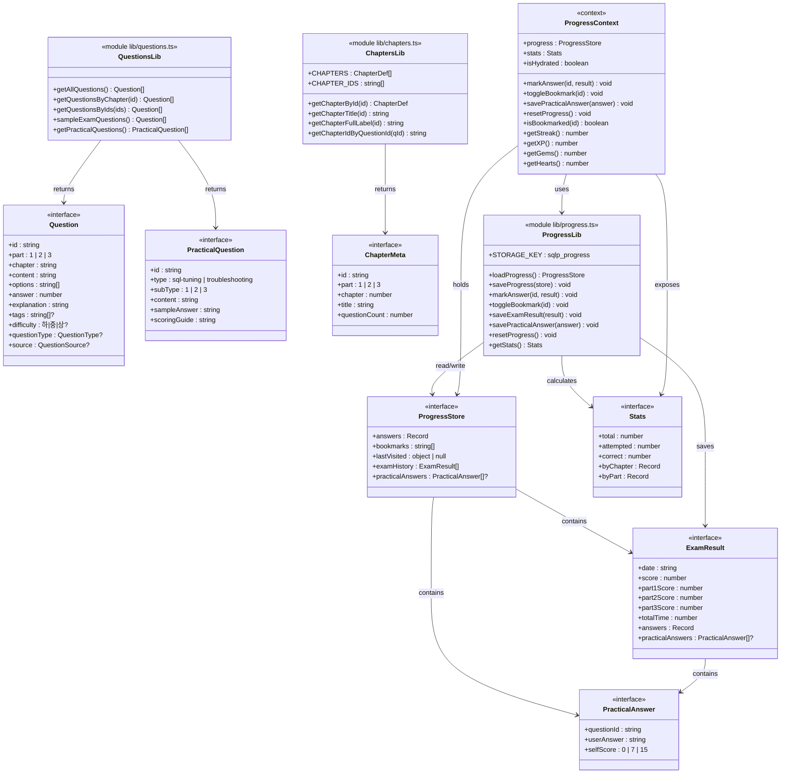

# 클래스 설계서

| 항목 | 내용 |
|:---|:---|
| 사업명 | SQLP 시험 준비 웹 사이트 |
| 기술 스택 | Next.js 14 (Pages Router) · TypeScript · React Context · localStorage |
| 클래스 수 | 11개 (Interface 7 + Lib Module 3 + Context 1) |
| 작성 일시 | 2026-06-04 |
| 버전 | v0.1 |

> **레이어 구성 안내**: 서버리스 정적 사이트(Next.js SSG)이므로 전통적 4계층 대신 프로젝트 구조에 맞는 5레이어를 사용한다.
> `Types → Lib → Context → Component → Pages` (상위 레이어는 하위 레이어에만 의존)

---

## 1. 클래스 목록

| CLS-ID | 클래스명 | 레이어 | 설명 | 연계 UC |
|:---|:---|:---:|:---|:---|
| CLS-001 | Question | Types | 객관식 문제 인터페이스. `part: 1\|2\|3`으로 확장 | UC-002~006 |
| CLS-002 | PracticalQuestion | Types | 실기 문제 인터페이스 (신규) | UC-007 |
| CLS-003 | PracticalAnswer | Types | 실기 자기채점 답안 인터페이스 (신규) | UC-007 |
| CLS-004 | ExamResult | Types | 모의고사 결과. `part3Score` 추가 | UC-003, UC-004 |
| CLS-005 | ProgressStore | Types | localStorage 저장 구조. `practicalAnswers` 추가 | UC-002~008 |
| CLS-006 | ChapterMeta | Types | 챕터 메타데이터. `part: 1\|2\|3` 확장 | UC-001~002 |
| CLS-007 | Stats | Types | 정답률 통계 집계 결과 | UC-008 |
| CLS-008 | ChaptersLib | Lib | 12챕터 상수·조회 유틸 (`lib/chapters.ts`) | UC-001~002 |
| CLS-009 | QuestionsLib | Lib | 문제 로드·샘플링 유틸 (`lib/questions.ts`) | UC-002~006 |
| CLS-010 | ProgressLib | Lib | 진도 저장·불러오기·통계 (`lib/progress.ts`) | UC-002~008 |
| CLS-011 | ProgressContext | Context | 전역 진도 상태 관리 (`context/ProgressContext.tsx`) | UC-002~008 |

---

## 2. 클래스 다이어그램



---

## 3. 클래스별 상세 정의

---

### CLS-001: Question

| 항목 | 내용 |
|:---|:---|
| 레이어 | Types |
| 패키지 | `types/index.ts` |
| 설명 | 객관식 문제 단일 인터페이스. SQLD 대비 `part`가 `1\|2` → `1\|2\|3`으로 확장 |
| 연계 UC | UC-002(단원별풀이), UC-003(모의고사), UC-005(오답재풀이), UC-006(북마크) |

**속성**

| 접근제어자 | 속성명 | 타입 | 기본값 | 설명 |
|:---:|:---|:---|:---|:---|
| + | id | `string` | — | `p[1-3]c[1-7]_DDD` 형식 (BR-009) |
| + | part | `1 \| 2 \| 3` | — | 과목 번호. **기존 `1\|2`에서 3 추가** |
| + | chapter | `string` | — | `part[1-3]_ch[1-7]` 형식 (BR-022) |
| + | content | `string` | — | 문제 본문 (마크다운 가능) |
| + | options | `string[]` | — | 보기 4개 고정 |
| + | answer | `number` | — | 정답 인덱스 (0-based) |
| + | explanation | `string` | — | 해설 |
| + | tags | `string[]` | undefined | 키워드 태그 |
| + | difficulty | `'하' \| '중' \| '상'` | undefined | 난이도 |
| + | questionType | `QuestionType` | undefined | `concept\|result\|completion\|error` |
| + | source | `QuestionSource` | undefined | `chapter\|mockexam1\|mockexam2` |

**메서드** — 인터페이스이므로 메서드 없음

**의존 관계**

| 관계 유형 | 대상 클래스 | 설명 |
|:---:|:---|:---|
| uses | QuestionType | questionType 필드 타입 |
| uses | QuestionSource | source 필드 타입 |

---

### CLS-002: PracticalQuestion ★신규

| 항목 | 내용 |
|:---|:---|
| 레이어 | Types |
| 패키지 | `types/index.ts` |
| 설명 | 실기 문제 인터페이스. SQL 튜닝(3유형)·성능 트러블슈팅(2유형) 모두 포함 |
| 연계 UC | UC-007(실기문제연습) |

**속성**

| 접근제어자 | 속성명 | 타입 | 기본값 | 설명 |
|:---:|:---|:---|:---|:---|
| + | id | `string` | — | `practical_DDD` 형식 |
| + | type | `'sql-tuning' \| 'troubleshooting'` | — | 실기 유형 (BR-017) |
| + | subType | `1 \| 2 \| 3` | — | 유형 내 세부 번호 |
| + | content | `string` | — | 지문 (마크다운) |
| + | sampleAnswer | `string` | — | 모범 답안 (제출 후 공개, BR-015) |
| + | scoringGuide | `string` | — | 채점 기준 설명 |

**의존 관계** — 없음 (독립 인터페이스)

---

### CLS-003: PracticalAnswer ★신규

| 항목 | 내용 |
|:---|:---|
| 레이어 | Types |
| 패키지 | `types/index.ts` |
| 설명 | 실기 자기채점 답안. selfScore는 0·7·15 리터럴 타입으로 강제 (BR-014) |
| 연계 UC | UC-007(실기문제연습) |

**속성**

| 접근제어자 | 속성명 | 타입 | 기본값 | 설명 |
|:---:|:---|:---|:---|:---|
| + | questionId | `string` | — | 연결된 PracticalQuestion.id |
| + | userAnswer | `string` | — | 학습자 작성 SQL 답안 (BR-016) |
| + | selfScore | `0 \| 7 \| 15` | — | 자기채점 점수. 세 값만 허용 (BR-014) |

**의존 관계**

| 관계 유형 | 대상 클래스 | 설명 |
|:---:|:---|:---|
| references | PracticalQuestion | questionId로 참조 |

---

### CLS-004: ExamResult

| 항목 | 내용 |
|:---|:---|
| 레이어 | Types |
| 패키지 | `types/index.ts` |
| 설명 | 모의고사 결과. `part3Score`와 `practicalAnswers` 추가 (SQLD → SQLP) |
| 연계 UC | UC-003(모의고사응시), UC-004(결과확인) |

**속성**

| 접근제어자 | 속성명 | 타입 | 기본값 | 설명 |
|:---:|:---|:---|:---|:---|
| + | date | `string` | — | ISO 8601 일시 |
| + | score | `number` | — | 전체 점수 (100점 만점) |
| + | part1Score | `number` | — | 1과목 점수 (최대 10) |
| + | part2Score | `number` | — | 2과목 점수 (최대 20) |
| + | part3Score | `number` | — | **3과목 점수 (최대 40) ★신규** |
| + | totalTime | `number` | — | 소요 시간 (초) |
| + | answers | `Record<string, number>` | — | questionId → 선택 인덱스 |
| + | practicalAnswers | `PracticalAnswer[]` | undefined | **실기 자기채점 목록 ★신규** |

**합격 판정 로직 (BR-001, BR-002)**:
```
합격 = score >= 60 && part1Score >= 4 && part2Score >= 8 && part3Score >= 16
```

**의존 관계**

| 관계 유형 | 대상 클래스 | 설명 |
|:---:|:---|:---|
| contains | PracticalAnswer | 실기 답안 배열 |

---

### CLS-005: ProgressStore

| 항목 | 내용 |
|:---|:---|
| 레이어 | Types |
| 패키지 | `types/index.ts` |
| 설명 | localStorage(`sqlp_progress`)에 저장되는 전체 진도 구조 (BR-019) |
| 연계 UC | UC-002~008 전체 |

**속성**

| 접근제어자 | 속성명 | 타입 | 기본값 | 설명 |
|:---:|:---|:---|:---|:---|
| + | answers | `Record<string, AnswerResult>` | `{}` | 문제별 정답/오답/건너뜀 |
| + | bookmarks | `string[]` | `[]` | 북마크된 문제 ID 배열 |
| + | lastVisited | `{type, id} \| null` | `null` | 마지막 방문 위치 |
| + | examHistory | `ExamResult[]` | `[]` | 모의고사 이력 (최대 10개) |
| + | practicalAnswers | `PracticalAnswer[]` | undefined | **실기 자기채점 이력 ★신규** |

**의존 관계**

| 관계 유형 | 대상 클래스 | 설명 |
|:---:|:---|:---|
| contains | ExamResult | examHistory 항목 |
| contains | PracticalAnswer | practicalAnswers 항목 |

---

### CLS-006: ChapterMeta

| 항목 | 내용 |
|:---|:---|
| 레이어 | Types |
| 패키지 | `types/index.ts` |
| 설명 | 챕터 메타데이터. `part: 1\|2` → `1\|2\|3` 확장 |
| 연계 UC | UC-001(이론학습), UC-002(단원별풀이) |

**속성**

| 접근제어자 | 속성명 | 타입 | 기본값 | 설명 |
|:---:|:---|:---|:---|:---|
| + | id | `string` | — | `part[1-3]_ch[1-7]` 형식 (BR-022) |
| + | part | `1 \| 2 \| 3` | — | **과목 번호 ★3 추가** |
| + | chapter | `number` | — | 장 번호 |
| + | title | `string` | — | 챕터 제목 (한국어) |
| + | questionCount | `number` | 0 | 해당 챕터 문제 수 |

---

### CLS-007: Stats

| 항목 | 내용 |
|:---|:---|
| 레이어 | Types |
| 패키지 | `types/index.ts` |
| 설명 | 정답률 통계 집계 결과. 구조 변경 없음 |
| 연계 UC | UC-008(대시보드) |

**속성**

| 접근제어자 | 속성명 | 타입 | 기본값 | 설명 |
|:---:|:---|:---|:---|:---|
| + | total | `number` | — | 전체 문제 수 |
| + | attempted | `number` | — | 시도 문제 수 |
| + | correct | `number` | — | 정답 문제 수 |
| + | byChapter | `Record<string, {...}>` | — | 챕터별 통계 |
| + | byPart | `Record<number, {...}>` | — | 과목별 통계 (1/2/3과목) |

---

### CLS-008: ChaptersLib

| 항목 | 내용 |
|:---|:---|
| 레이어 | Lib |
| 패키지 | `lib/chapters.ts` |
| 설명 | 12챕터 상수 배열 및 조회 유틸. CHAPTERS 5개→12개로 확장 (BR-021) |
| 연계 UC | UC-001(이론학습), UC-002(단원별풀이) |

**속성 (모듈 상수)**

| 접근제어자 | 속성명 | 타입 | 기본값 | 설명 |
|:---:|:---|:---|:---|:---|
| + | CHAPTERS | `ChapterDef[]` | 12개 항목 | **Part 3 7챕터 추가** (BR-021 단일 소스) |
| + | CHAPTER_IDS | `string[]` | CHAPTERS 파생 | 챕터 ID 배열 |
| + | CHAPTER_BY_ID | `Record<string, ChapterDef>` | CHAPTERS 파생 | ID → 챕터 조회 맵 |

**메서드**

| 접근제어자 | 메서드명 | 파라미터 | 반환 타입 | 설명 |
|:---:|:---|:---|:---|:---|
| + | getChapterById | `id: string` | `ChapterDef \| undefined` | ID로 챕터 조회 |
| + | getChapterTitle | `id: string` | `string` | 챕터 제목 반환 |
| + | getChapterFullLabel | `id: string` | `string` | "N과목 M장 - 제목" 형식 |
| + | getChapterIdByQuestionId | `questionId: string` | `string \| undefined` | 문제 ID에서 챕터 ID 역추론 |

**CHAPTERS 확장 목표 (Part 3)**:
```
part3_ch1: SQL 수행 구조
part3_ch2: SQL 분석 도구
part3_ch3: 인덱스 튜닝
part3_ch4: 조인 튜닝
part3_ch5: SQL 옵티마이저
part3_ch6: 고급 SQL 튜닝
part3_ch7: Lock과 트랜잭션 동시성 제어
```

**의존 관계**

| 관계 유형 | 대상 클래스 | 설명 |
|:---:|:---|:---|
| returns | ChapterMeta | CHAPTERS 항목 타입 |

---

### CLS-009: QuestionsLib

| 항목 | 내용 |
|:---|:---|
| 레이어 | Lib |
| 패키지 | `lib/questions.ts` |
| 설명 | 문제 JSON 로드·필터·샘플링. Part 3 파일 로딩 추가 |
| 연계 UC | UC-002~006(문제풀이), UC-007(실기) |

**메서드**

| 접근제어자 | 메서드명 | 파라미터 | 반환 타입 | 설명 |
|:---:|:---|:---|:---|:---|
| + | getAllQuestions | — | `Question[]` | 전체 챕터 문제 (Part 1~3) |
| + | getQuestionsByChapter | `chapterId: string` | `Question[]` | 특정 챕터 문제 |
| + | getQuestionsByIds | `ids: string[]` | `Question[]` | ID 배열로 문제 조회 |
| + | sampleExamQuestions | — | `Question[]` | 70문항 샘플링 (BR-003: P1:10+P2:20+P3:40) |
| + | getWrongQuestions | `store: ProgressStore` | `Question[]` | 오답 문제 필터링 (BR-007) |
| + | getBookmarkedQuestions | `store: ProgressStore` | `Question[]` | 북마크 문제 조회 |
| + | getPracticalQuestions | — | `PracticalQuestion[]` | 실기 문제 전체 로드 |

**의존 관계**

| 관계 유형 | 대상 클래스 | 설명 |
|:---:|:---|:---|
| returns | Question | 객관식 문제 |
| returns | PracticalQuestion | 실기 문제 |
| uses | ChaptersLib | CHAPTERS로 파일 경로 결정 |

---

### CLS-010: ProgressLib

| 항목 | 내용 |
|:---|:---|
| 레이어 | Lib |
| 패키지 | `lib/progress.ts` |
| 설명 | localStorage 읽기·쓰기·통계. `STORAGE_KEY` `sqld_progress` → **`sqlp_progress`** 변경 |
| 연계 UC | UC-002~008 전체 |

**속성 (모듈 상수)**

| 접근제어자 | 속성명 | 타입 | 기본값 | 설명 |
|:---:|:---|:---|:---|:---|
| + | STORAGE_KEY | `string` | `'sqlp_progress'` | **변경 필수** (BR-019) |
| + | MAX_EXAM_HISTORY | `number` | `10` | 최대 이력 보관 수 |

**메서드**

| 접근제어자 | 메서드명 | 파라미터 | 반환 타입 | 설명 |
|:---:|:---|:---|:---|:---|
| + | loadProgress | — | `ProgressStore` | localStorage 로드. SSR 가드 포함 (BR-018) |
| + | saveProgress | `store: ProgressStore` | `void` | localStorage 저장 |
| + | markAnswer | `id: string, result: AnswerResult` | `void` | 문제 답변 기록 |
| + | toggleBookmark | `id: string` | `void` | 북마크 토글 (BR-008) |
| + | saveExamResult | `result: ExamResult` | `void` | 모의고사 결과 저장 |
| + | savePracticalAnswer | `answer: PracticalAnswer` | `void` | **실기 답안 저장 ★신규** (BR-016) |
| + | resetProgress | — | `void` | 진도 초기화 |
| + | getStats | — | `Stats` | 3과목 통계 계산 반환 |

**`getStats` 변경점**: `byPart` 초기화를 `{ 1: {...}, 2: {...}, 3: {...} }`로 확장 (기존 `1, 2`만)

**의존 관계**

| 관계 유형 | 대상 클래스 | 설명 |
|:---:|:---|:---|
| read/write | ProgressStore | localStorage 키-값 |
| saves | ExamResult | examHistory에 추가 |
| saves | PracticalAnswer | practicalAnswers에 추가 |
| calculates | Stats | getStats() 반환 |
| uses | QuestionsLib | getAllQuestions()로 통계 계산 |

---

### CLS-011: ProgressContext

| 항목 | 내용 |
|:---|:---|
| 레이어 | Context |
| 패키지 | `context/ProgressContext.tsx` |
| 설명 | 전역 진도 상태 Context. `savePracticalAnswer` 메서드 추가 |
| 연계 UC | UC-002~008 전체 |

**속성**

| 접근제어자 | 속성명 | 타입 | 기본값 | 설명 |
|:---:|:---|:---|:---|:---|
| + | progress | `ProgressStore` | defaultProgress() | 현재 진도 상태 |
| + | stats | `Stats` | — | 통계 (progress 기반 파생) |
| + | isHydrated | `boolean` | `false` | localStorage 로드 완료 여부 |

**메서드**

| 접근제어자 | 메서드명 | 파라미터 | 반환 타입 | 설명 |
|:---:|:---|:---|:---|:---|
| + | markAnswer | `id, result` | `void` | 문제 답변 기록 후 통계 갱신 |
| + | toggleBookmark | `id` | `void` | 북마크 토글 |
| + | savePracticalAnswer | `answer: PracticalAnswer` | `void` | **실기 자기채점 저장 ★신규** |
| + | resetProgress | — | `void` | 전체 초기화 |
| + | isBookmarked | `id: string` | `boolean` | 북마크 여부 확인 |
| + | getStreak | — | `number` | UI-only 연속 학습일 |
| + | getXP | — | `number` | UI-only XP (correct × 10) |
| + | getGems | — | `number` | UI-only 보석 |
| + | getHearts | — | `number` | 고정값 3 |

**의존 관계**

| 관계 유형 | 대상 클래스 | 설명 |
|:---:|:---|:---|
| uses | ProgressLib | 모든 저장·조회 위임 |
| holds | ProgressStore | state로 보관 |
| exposes | Stats | 컴포넌트에 노출 |

---

## 4. 레이어 의존 관계

```
Pages 레이어 (pages/**/*.tsx)
    │  getStaticPaths/Props에서 ChaptersLib, QuestionsLib 직접 사용
    │
    ▼
Component 레이어 (components/**/*.tsx)
    │  useContext(ProgressContext) 로 진도 접근
    │
    ▼
Context 레이어 (context/ProgressContext.tsx)
    │  ProgressLib 호출로 저장·조회
    │
    ▼
Lib 레이어 (lib/chapters.ts, lib/questions.ts, lib/progress.ts)
    │  types/index.ts 타입 import
    │
    ▼
Types 레이어 (types/index.ts)
    (의존 없음 — 최하위)
```

> **역방향 의존 금지**: Types 레이어에서 Lib·Context를 import하지 않는다.

---

## 5. 패키지 구조

```
sqlp/
├── types/
│   └── index.ts                   ← CLS-001~007 (인터페이스 정의)
│       ├── Question               ← part: 1|2|3 ★변경
│       ├── PracticalQuestion      ← ★신규
│       ├── PracticalAnswer        ← ★신규
│       ├── ExamResult             ← part3Score 추가 ★변경
│       ├── ProgressStore          ← practicalAnswers 추가 ★변경
│       ├── ChapterMeta            ← part: 1|2|3 ★변경
│       └── Stats
│
├── lib/
│   ├── chapters.ts                ← CLS-008 (CHAPTERS 12챕터 ★변경)
│   ├── questions.ts               ← CLS-009 (Part3 로딩, 70문항 샘플링 ★변경)
│   ├── progress.ts                ← CLS-010 (STORAGE_KEY, savePracticalAnswer ★변경)
│   └── theory.ts                  (변경 없음)
│
├── context/
│   └── ProgressContext.tsx        ← CLS-011 (savePracticalAnswer ★변경)
│
├── data/
│   ├── questions/
│   │   ├── part1_ch1.json ~ part2_ch3.json   (기존)
│   │   └── part3_ch1.json ~ part3_ch7.json   ★신규
│   ├── theory/
│   │   ├── part1_ch1.md ~ part2_ch3.md       (기존)
│   │   └── part3_ch1.md ~ part3_ch7.md       ★신규
│   ├── practical/
│   │   └── questions.json                     ★신규
│   └── mockexam/
│       ├── exam1.json             ← 70문항 재구성 ★변경
│       └── exam2.json             ← 70문항 재구성 ★변경
│
└── pages/ components/             (기존 구조 유지, 컴포넌트 수정은 별도 설계)
```

---

## 6. UC-클래스 커버리지

| UC-ID | UC명 | 연계 CLS-ID | 커버 상태 |
|:---|:---|:---|:---:|
| UC-001 | 이론 콘텐츠 학습 | CLS-006, CLS-008 | ✅ |
| UC-002 | 단원별 문제 풀이 | CLS-001, CLS-009, CLS-010, CLS-011 | ✅ |
| UC-003 | 전체 모의고사 응시 | CLS-001, CLS-004, CLS-009, CLS-010 | ✅ |
| UC-004 | 모의고사 결과 확인 | CLS-004, CLS-010 | ✅ |
| UC-005 | 오답 재풀이 | CLS-001, CLS-005, CLS-009, CLS-010 | ✅ |
| UC-006 | 북마크 문제 풀이 | CLS-001, CLS-005, CLS-009, CLS-010 | ✅ |
| UC-007 | 실기 문제 연습 | CLS-002, CLS-003, CLS-009, CLS-010, CLS-011 | ✅ |
| UC-008 | 학습 진도 대시보드 확인 | CLS-005, CLS-007, CLS-010, CLS-011 | ✅ |

**커버리지**: 8건 / 8건 (100%)

---

## 문서 버전 이력

| 버전 | 일자 | 작성자 | 변경 내용 |
|:---|:---|:---|:---|
| v0.1 | 2026-06-04 | 초안 작성 | ai-dlc-class-design 스킬로 최초 생성. 기존 코드(types/index.ts, lib/*.ts) 기반 SQLP 확장 설계. CLS-002·003(신규), CLS-004·005·006·008·009·010·011(변경) |
