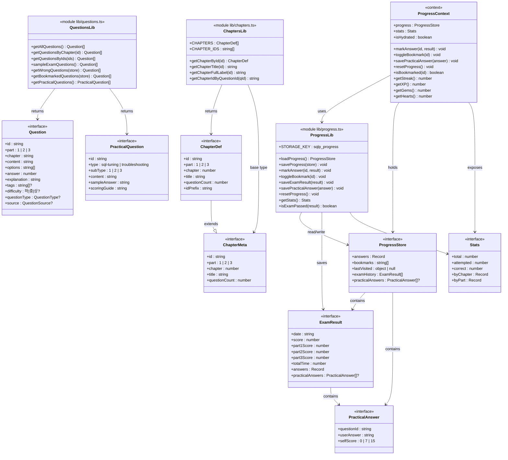

# 클래스 설계서

| 항목 | 내용 |
|:---|:---|
| 사업명 | SQLP 시험 준비 웹 사이트 |
| 기술 스택 | Next.js 14 (Pages Router) · TypeScript · React Context · localStorage |
| 클래스 수 | 12개 (Interface 8 + Lib Module 3 + Context 1) |
| 작성 일시 | 2026-06-04 |
| 버전 | v0.2 |

> **레이어 구성 안내**: 서버리스 정적 사이트(Next.js SSG)이므로 전통적 4계층 대신 프로젝트 구조에 맞는 5레이어를 사용한다.
> `Types → Lib → Context → Component → Pages` (상위 레이어는 하위 레이어에만 의존)

> **v0.2 변경 요약**: ① CLS-010 ProgressLib에 `isExamPassed()` 추가, ② CLS-012 ChapterDef 인터페이스 신규 정의, ③ 공통 타입 별칭 섹션 추가

---

## 1. 클래스 목록

| CLS-ID | 클래스명 | 레이어 | 설명 | 연계 UC |
|:---|:---|:---:|:---|:---|
| CLS-001 | Question | Types | 객관식 문제 인터페이스. `part: 1\|2\|3`으로 확장 | UC-002~006 |
| CLS-002 | PracticalQuestion | Types | 실기 문제 인터페이스 (신규) | UC-007 |
| CLS-003 | PracticalAnswer | Types | 실기 자기채점 답안 인터페이스 (신규) | UC-007 |
| CLS-004 | ExamResult | Types | 모의고사 결과. `part3Score` 추가 | UC-003, UC-004 |
| CLS-005 | ProgressStore | Types | localStorage 저장 구조. `practicalAnswers` 추가 | UC-002~008 |
| CLS-006 | ChapterMeta | Types | 챕터 메타데이터. `part: 1\|2\|3` 확장 | UC-001~002 |
| CLS-007 | Stats | Types | 정답률 통계 집계 결과 | UC-008 |
| **CLS-012** | **ChapterDef** | **Types** | **챕터 확장 메타 (CLS-006 확장). `idPrefix` 추가 ★신규** | UC-001~002 |
| CLS-008 | ChaptersLib | Lib | 12챕터 상수·조회 유틸 (`lib/chapters.ts`) | UC-001~002 |
| CLS-009 | QuestionsLib | Lib | 문제 로드·샘플링 유틸 (`lib/questions.ts`) | UC-002~006 |
| CLS-010 | ProgressLib | Lib | 진도 저장·불러오기·통계·**합격 판정** (`lib/progress.ts`) | UC-002~008 |
| CLS-011 | ProgressContext | Context | 전역 진도 상태 관리 (`context/ProgressContext.tsx`) | UC-002~008 |

---

## 2. 공통 타입 별칭 ★v0.2 신규

> `types/index.ts`에 정의되는 단순 타입 별칭. 클래스 노드가 아닌 참조형으로 사용.

```typescript
type AnswerResult = 'correct' | 'wrong' | 'skipped'
type QuestionType = 'concept' | 'result' | 'completion' | 'error'
type QuestionSource = 'chapter' | 'mockexam1' | 'mockexam2'
type QuizMode = 'chapter' | 'exam' | 'wrong' | 'bookmarks'
```

| 타입명 | 값 | 사용 클래스 |
|:---|:---|:---|
| `AnswerResult` | `'correct' \| 'wrong' \| 'skipped'` | CLS-005 (answers), CLS-010 (markAnswer) |
| `QuestionType` | `'concept' \| 'result' \| 'completion' \| 'error'` | CLS-001 (questionType?) |
| `QuestionSource` | `'chapter' \| 'mockexam1' \| 'mockexam2'` | CLS-001 (source?) |
| `QuizMode` | `'chapter' \| 'exam' \| 'wrong' \| 'bookmarks'` | CLS-005 (lastVisited.type) |

---

## 3. 클래스 다이어그램



---

## 4. 클래스별 상세 정의

---

### CLS-001: Question

| 항목 | 내용 |
|:---|:---|
| 레이어 | Types |
| 패키지 | `types/index.ts` |
| 설명 | 객관식 문제 단일 인터페이스. `part: 1\|2\|3` 확장 |
| 연계 UC | UC-002~006 |

**속성**

| 접근제어자 | 속성명 | 타입 | 기본값 | 설명 |
|:---:|:---|:---|:---|:---|
| + | id | `string` | — | `p[1-3]c[1-7]_DDD` 형식 |
| + | part | `1 \| 2 \| 3` | — | 과목 번호 |
| + | chapter | `string` | — | `part[1-3]_ch[1-7]` 형식 |
| + | content | `string` | — | 문제 본문 |
| + | options | `string[]` | — | 보기 4개 고정 |
| + | answer | `number` | — | 0-based 인덱스 |
| + | explanation | `string` | — | 해설 |
| + | tags | `string[]` | undefined | 키워드 태그 |
| + | difficulty | `'하' \| '중' \| '상'` | undefined | 난이도 |
| + | questionType | `QuestionType` | undefined | `concept\|result\|completion\|error` |
| + | source | `QuestionSource` | undefined | `chapter\|mockexam1\|mockexam2` |

---

### CLS-002: PracticalQuestion

| 항목 | 내용 |
|:---|:---|
| 레이어 | Types |
| 패키지 | `types/index.ts` |
| 설명 | 실기 문제 인터페이스. sql-tuning 3유형, troubleshooting 2유형 |
| 연계 UC | UC-007 |

**속성**

| 접근제어자 | 속성명 | 타입 | 기본값 | 설명 |
|:---:|:---|:---|:---|:---|
| + | id | `string` | — | `practical_DDD` 형식 |
| + | type | `'sql-tuning' \| 'troubleshooting'` | — | 실기 유형 |
| + | subType | `1 \| 2 \| 3` | — | 유형 내 세부 번호 |
| + | content | `string` | — | 지문 (마크다운) |
| + | sampleAnswer | `string` | — | 모범 답안 (제출 후 공개) |
| + | scoringGuide | `string` | — | 채점 기준 |

---

### CLS-003: PracticalAnswer

| 항목 | 내용 |
|:---|:---|
| 레이어 | Types |
| 패키지 | `types/index.ts` |
| 설명 | 실기 자기채점 답안. selfScore는 0·7·15 리터럴 타입 강제 |
| 연계 UC | UC-007 |

**속성**

| 접근제어자 | 속성명 | 타입 | 기본값 | 설명 |
|:---:|:---|:---|:---|:---|
| + | questionId | `string` | — | PracticalQuestion.id 참조 |
| + | userAnswer | `string` | — | SQL 답안 |
| + | selfScore | `0 \| 7 \| 15` | — | 자기채점 점수 |

---

### CLS-004: ExamResult

| 항목 | 내용 |
|:---|:---|
| 레이어 | Types |
| 패키지 | `types/index.ts` |
| 설명 | 모의고사 결과. `part3Score`·`practicalAnswers` 추가 |
| 연계 UC | UC-003, UC-004 |

**속성**

| 접근제어자 | 속성명 | 타입 | 기본값 | 설명 |
|:---:|:---|:---|:---|:---|
| + | date | `string` | — | ISO 8601 |
| + | score | `number` | — | 전체 점수 |
| + | part1Score | `number` | — | 1과목 점수 (최대 10) |
| + | part2Score | `number` | — | 2과목 점수 (최대 20) |
| + | part3Score | `number` | — | 3과목 점수 (최대 40) ★신규 |
| + | totalTime | `number` | — | 소요 시간(초) |
| + | answers | `Record<string, number>` | — | questionId → 선택 인덱스 |
| + | practicalAnswers | `PracticalAnswer[]` | undefined | 실기 자기채점 목록 ★신규 |

**합격 판정 (ProgressLib.isExamPassed 참조)**:
```
합격 = score ≥ 60 && part1Score ≥ 4 && part2Score ≥ 8 && part3Score ≥ 16
```

---

### CLS-005: ProgressStore

| 항목 | 내용 |
|:---|:---|
| 레이어 | Types |
| 패키지 | `types/index.ts` |
| 설명 | localStorage(`sqlp_progress`)에 저장되는 전체 진도 구조 |
| 연계 UC | UC-002~008 |

**속성**

| 접근제어자 | 속성명 | 타입 | 기본값 | 설명 |
|:---:|:---|:---|:---|:---|
| + | answers | `Record<string, AnswerResult>` | `{}` | 문제별 정답/오답/건너뜀 |
| + | bookmarks | `string[]` | `[]` | 북마크 문제 ID |
| + | lastVisited | `{type, id} \| null` | `null` | 마지막 방문 위치 |
| + | examHistory | `ExamResult[]` | `[]` | 모의고사 이력 (최대 10개) |
| + | practicalAnswers | `PracticalAnswer[]` | undefined | 실기 자기채점 이력 |

---

### CLS-006: ChapterMeta

| 항목 | 내용 |
|:---|:---|
| 레이어 | Types |
| 패키지 | `types/index.ts` |
| 설명 | 챕터 메타데이터 기본 인터페이스. CLS-012(ChapterDef)의 부모 |
| 연계 UC | UC-001~002 |

**속성**

| 접근제어자 | 속성명 | 타입 | 기본값 | 설명 |
|:---:|:---|:---|:---|:---|
| + | id | `string` | — | `part[1-3]_ch[1-7]` 형식 |
| + | part | `1 \| 2 \| 3` | — | 과목 번호 |
| + | chapter | `number` | — | 장 번호 |
| + | title | `string` | — | 챕터 제목 |
| + | questionCount | `number` | 0 | 문제 수 |

---

### CLS-007: Stats

| 항목 | 내용 |
|:---|:---|
| 레이어 | Types |
| 패키지 | `types/index.ts` |
| 설명 | 정답률 통계. byPart는 1/2/3과목 모두 포함 |
| 연계 UC | UC-008 |

**속성**

| 접근제어자 | 속성명 | 타입 | 기본값 | 설명 |
|:---:|:---|:---|:---|:---|
| + | total | `number` | — | 전체 문제 수 |
| + | attempted | `number` | — | 시도 수 |
| + | correct | `number` | — | 정답 수 |
| + | byChapter | `Record<string, {...}>` | — | 챕터별 통계 |
| + | byPart | `Record<number, {...}>` | — | 과목별 통계 (1/2/3) |

---

### CLS-012: ChapterDef ★v0.2 신규

| 항목 | 내용 |
|:---|:---|
| 레이어 | Types |
| 패키지 | `lib/chapters.ts` |
| 설명 | CLS-006(ChapterMeta) 확장. `idPrefix` 필드 추가. CHAPTERS 배열 항목 타입 |
| 연계 UC | UC-001~002 |

**속성**

| 접근제어자 | 속성명 | 타입 | 기본값 | 설명 |
|:---:|:---|:---|:---|:---|
| + | id | `string` (상속) | — | `part[1-3]_ch[1-7]` |
| + | part | `1 \| 2 \| 3` (상속) | — | 과목 번호 |
| + | chapter | `number` (상속) | — | 장 번호 |
| + | title | `string` (상속) | — | 챕터 제목 |
| + | questionCount | `number` (상속) | 0 | 문제 수 |
| + | **idPrefix** | **`string`** | — | **문제 ID 접두어 (`"p3c1_"` 등). `getChapterIdByQuestionId()`에서 활용** |

**의존 관계**

| 관계 유형 | 대상 클래스 | 설명 |
|:---:|:---|:---|
| extends | ChapterMeta (CLS-006) | ChapterMeta 모든 속성 상속 |

---

### CLS-008: ChaptersLib

| 항목 | 내용 |
|:---|:---|
| 레이어 | Lib |
| 패키지 | `lib/chapters.ts` |
| 설명 | 12챕터 상수·조회 유틸. CHAPTERS 항목 타입은 ChapterDef(CLS-012) |
| 연계 UC | UC-001~002 |

**메서드**

| 접근제어자 | 메서드명 | 파라미터 | 반환 타입 | 설명 |
|:---:|:---|:---|:---|:---|
| + | getChapterById | `id: string` | `ChapterDef \| undefined` | ID로 챕터 조회 |
| + | getChapterTitle | `id: string` | `string` | 챕터 제목 반환 |
| + | getChapterFullLabel | `id: string` | `string` | "N과목 M장 - 제목" 형식 |
| + | getChapterIdByQuestionId | `questionId: string` | `string \| undefined` | idPrefix 매칭으로 챕터 ID 역추론 |

---

### CLS-009: QuestionsLib

| 항목 | 내용 |
|:---|:---|
| 레이어 | Lib |
| 패키지 | `lib/questions.ts` |
| 설명 | 문제 JSON 로드·필터·샘플링. Part 3 + 실기 포함 |
| 연계 UC | UC-002~006, UC-007 |

**메서드**

| 접근제어자 | 메서드명 | 파라미터 | 반환 타입 | 설명 |
|:---:|:---|:---|:---|:---|
| + | getAllQuestions | — | `Question[]` | 전체 (Part 1~3) |
| + | getQuestionsByChapter | `chapterId: string` | `Question[]` | 챕터별 조회 |
| + | getQuestionsByIds | `ids: string[]` | `Question[]` | ID 배열 조회 |
| + | sampleExamQuestions | — | `Question[]` | 70문항 샘플링 (P1:10+P2:20+P3:40) |
| + | getWrongQuestions | `store: ProgressStore` | `Question[]` | 오답 필터링 |
| + | getBookmarkedQuestions | `store: ProgressStore` | `Question[]` | 북마크 조회 |
| + | getPracticalQuestions | — | `PracticalQuestion[]` | 실기 문제 전체 |

---

### CLS-010: ProgressLib ★v0.2 수정

| 항목 | 내용 |
|:---|:---|
| 레이어 | Lib |
| 패키지 | `lib/progress.ts` |
| 설명 | localStorage 읽기·쓰기·통계·**합격 판정 (isExamPassed 추가)**. STORAGE_KEY `sqlp_progress` |
| 연계 UC | UC-002~008 |

**속성**

| 접근제어자 | 속성명 | 타입 | 기본값 | 설명 |
|:---:|:---|:---|:---|:---|
| + | STORAGE_KEY | `string` | `'sqlp_progress'` | localStorage 키 |
| + | MAX_EXAM_HISTORY | `number` | `10` | 이력 최대 보관 수 |

**메서드**

| 접근제어자 | 메서드명 | 파라미터 | 반환 타입 | 설명 |
|:---:|:---|:---|:---|:---|
| + | loadProgress | — | `ProgressStore` | localStorage 로드 (SSR 가드 포함) |
| + | saveProgress | `store: ProgressStore` | `void` | localStorage 저장 |
| + | markAnswer | `id: string, result: AnswerResult` | `void` | 답변 기록 |
| + | toggleBookmark | `id: string` | `void` | 북마크 토글 |
| + | saveExamResult | `result: ExamResult` | `void` | 모의고사 결과 저장 |
| + | savePracticalAnswer | `answer: PracticalAnswer` | `void` | 실기 답안 저장 |
| + | resetProgress | — | `void` | 진도 초기화 |
| + | getStats | — | `Stats` | 3과목 통계 계산 |
| + | **isExamPassed** | **`result: ExamResult`** | **`boolean`** | **합격 판정 (BR-001·002) ★신규** |

**isExamPassed 로직**:
```typescript
function isExamPassed(result: ExamResult): boolean {
  return (
    result.score >= 60 &&
    result.part1Score >= 4  &&   // 1과목 ≥ 40%
    result.part2Score >= 8  &&   // 2과목 ≥ 40%
    result.part3Score >= 16      // 3과목 ≥ 40%
  )
}
```

---

### CLS-011: ProgressContext

| 항목 | 내용 |
|:---|:---|
| 레이어 | Context |
| 패키지 | `context/ProgressContext.tsx` |
| 설명 | 전역 진도 상태 Context. ProgressLib 모든 저장·조회를 위임 |
| 연계 UC | UC-002~008 |

**속성**

| 접근제어자 | 속성명 | 타입 | 기본값 | 설명 |
|:---:|:---|:---|:---|:---|
| + | progress | `ProgressStore` | defaultProgress() | 현재 진도 |
| + | stats | `Stats` | — | 통계 (progress 기반) |
| + | isHydrated | `boolean` | `false` | localStorage 로드 완료 |

**메서드**

| 접근제어자 | 메서드명 | 파라미터 | 반환 타입 | 설명 |
|:---:|:---|:---|:---|:---|
| + | markAnswer | `id, result` | `void` | 답변 기록 |
| + | toggleBookmark | `id` | `void` | 북마크 토글 |
| + | savePracticalAnswer | `answer: PracticalAnswer` | `void` | 실기 답안 저장 |
| + | resetProgress | — | `void` | 초기화 |
| + | isBookmarked | `id: string` | `boolean` | 북마크 여부 |
| + | getStreak | — | `number` | UI-only 연속일 |
| + | getXP | — | `number` | UI-only XP |
| + | getGems | — | `number` | UI-only 보석 |
| + | getHearts | — | `number` | 고정값 3 |

---

## 5. 레이어 의존 관계

```
Pages 레이어 (pages/**/*.tsx)
    │
    ▼
Component 레이어 (components/**/*.tsx)
    │  useContext(ProgressContext) 진도 접근
    ▼
Context 레이어 (context/ProgressContext.tsx)
    │  ProgressLib 위임
    ▼
Lib 레이어 (lib/chapters.ts, lib/questions.ts, lib/progress.ts)
    │  types/index.ts 타입 import
    ▼
Types 레이어 (types/index.ts)
    (의존 없음 — 최하위)
```

---

## 6. 패키지 구조

```
sqlp/
├── types/
│   └── index.ts        ← CLS-001~007, 타입 별칭 (AnswerResult·QuestionType 등)
│
├── lib/
│   ├── chapters.ts     ← CLS-012(ChapterDef) + CLS-008(ChaptersLib)
│   ├── questions.ts    ← CLS-009(QuestionsLib)
│   ├── progress.ts     ← CLS-010(ProgressLib, isExamPassed ★신규)
│   └── theory.ts
│
└── context/
    └── ProgressContext.tsx  ← CLS-011
```

---

## 7. UC-클래스 커버리지

| UC-ID | UC명 | 연계 CLS-ID | 커버 상태 |
|:---|:---|:---|:---:|
| UC-001 | 이론 콘텐츠 학습 | CLS-006, CLS-008, CLS-012 | ✅ |
| UC-002 | 단원별 문제 풀이 | CLS-001, CLS-009, CLS-010, CLS-011 | ✅ |
| UC-003 | 전체 모의고사 응시 | CLS-001, CLS-004, CLS-009, CLS-010 | ✅ |
| UC-004 | 모의고사 결과 확인 | CLS-004, CLS-010(**isExamPassed**) | ✅ |
| UC-005 | 오답 재풀이 | CLS-001, CLS-005, CLS-009, CLS-010 | ✅ |
| UC-006 | 북마크 문제 풀이 | CLS-001, CLS-005, CLS-009, CLS-010 | ✅ |
| UC-007 | 실기 문제 연습 | CLS-002, CLS-003, CLS-009, CLS-010, CLS-011 | ✅ |
| UC-008 | 학습 진도 대시보드 확인 | CLS-005, CLS-007, CLS-010, CLS-011 | ✅ |

**커버리지**: 8건 / 8건 (100%)

---

## 문서 버전 이력

| 버전 | 일자 | 작성자 | 변경 내용 |
|:---|:---|:---|:---|
| v0.1 | 2026-06-04 | 초안 작성 | ai-dlc-class-design 스킬로 최초 생성 (CLS-001~011) |
| v0.2 | 2026-06-04 | 수정 | ai-dlc-class-revise: ① CLS-010에 `isExamPassed()` 추가 (BR-001·002), ② CLS-012 ChapterDef 신규 정의, ③ 공통 타입 별칭 섹션 추가 |
