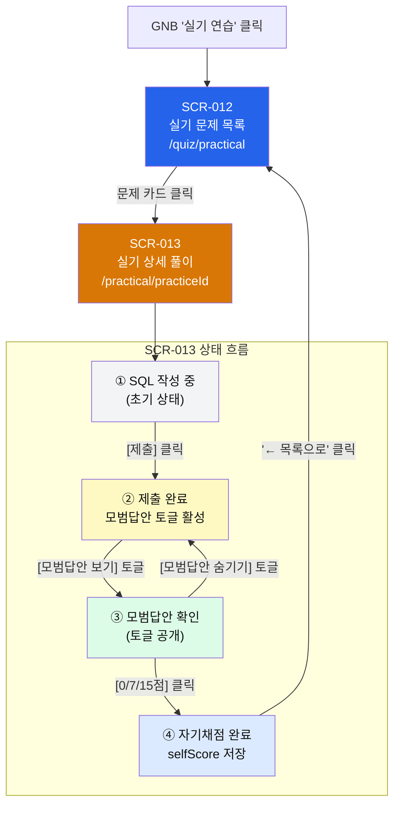

# 화면 정의서

| 항목 | 내용 |
|:---|:---|
| 사업명 | SQLP 시험 준비 웹 사이트 |
| 화면 수 | 2개 (SCR-012·013 실기 신규 화면) |
| 작성 일시 | 2026-06-04 |
| 버전 | v0.1 |

> **범위**: 실기 연습 신규 화면 2개만 상세 명세. 기존 화면(SCR-001~011)은 화면목록_SQLP_20260604.md 참조.

---

## 1. 화면 개요

| SCR-ID | 화면명 | 유형 | URL | 접근 권한 | 연계 UC |
|:---|:---|:---:|:---|:---|:---|
| SCR-012 | 실기 문제 목록 | LIST | `/quiz/practical` | 학습자 (비로그인) | UC-007 |
| SCR-013 | 실기 상세 풀이 | PROC | `/practical/[practiceId]` | 학습자 (비로그인) | UC-007 |

> 화면목록_SQLP_20260604.md 기준 SCR-010·011과 동일 화면. 명세서 채번 SCR-012·013 사용.

---

## 2. 화면별 상세 정의

---

### SCR-012: 실기 문제 목록

| 항목 | 내용 |
|:---|:---|
| 화면 유형 | LIST |
| URL 패턴 | `/quiz/practical` |
| 렌더링 방식 | SSG (getStaticProps로 practical/questions.json 빌드 타임 로드) |
| 접근 권한 | 학습자 (로그인 불필요) |
| 연계 UC | UC-007 (실기 문제 연습) |
| 연계 FR | FR-014 (실기 문제 목록) |
| 연계 BR | BR-017 (실기 문제 분류 — sql-tuning/troubleshooting 섹션 구분) |
| 진입 경로 | GNB "실기 연습" 클릭, 또는 직접 URL |
| 이탈 경로 | SCR-013(문제 카드 클릭), GNB 다른 메뉴 |

**레이아웃 (텍스트 박스)**

```
+============================================================+
|  SQLP 시험 준비  |  이론 학습  |  문제풀이  |  실기 연습  |
+============================================================+
|                                                            |
|  실기 연습                                                 |
|  SQL 튜닝 및 성능 트러블슈팅 문제를 풀어보세요            |
|                                                            |
+------------------------------------------------------------+
|  [섹션1] SQL 튜닝 (3유형)                                  |
|  ┌──────────────────┐ ┌──────────────────┐ ┌────────────┐ |
|  │ practical_001    │ │ practical_002    │ │ ...        │ |
|  │ 유형1: 성능 저하 │ │ 유형2: 실행계획  │ │            │ |
|  │ SQL 개선하기     │ │ 기반 SQL 작성    │ │            │ |
|  │   [풀기 →]       │ │   [풀기 →]       │ │ [풀기 →]   │ |
|  └──────────────────┘ └──────────────────┘ └────────────┘ |
|                                                            |
+------------------------------------------------------------+
|  [섹션2] 성능 트러블슈팅 (2유형)                           |
|  ┌──────────────────┐ ┌──────────────────┐                 |
|  │ practical_009    │ │ practical_010    │                 |
|  │ 유형1: 애플리케  │ │ 유형2: 성능 이슈 │                 |
|  │ 이션 성능 개선   │ │ 원인 분석        │                 |
|  │   [풀기 →]       │ │   [풀기 →]       │                 |
|  └──────────────────┘ └──────────────────┘                 |
+============================================================+
```

**입력 항목** — 없음 (정적 목록, 검색·필터 없음)

| 필드명 | 타입 | 필수 | 유효성 규칙 | 기본값 |
|:---|:---:|:---:|:---|:---|
| — | — | — | — | — |

**출력 항목**

| 필드명 | 타입 | 형식/정렬 | 비고 |
|:---|:---:|:---|:---|
| 섹션 제목 | string | `sql-tuning` → "SQL 튜닝 (3유형)", `troubleshooting` → "성능 트러블슈팅 (2유형)" | BR-017 |
| 문제 카드 | PracticalQuestion | 3열 그리드 (모바일: 1열) | 각 유형별 그룹핑 |
| 카드 — id | string | `practical_DDD` | 표시하지 않음 (내부 식별자) |
| 카드 — 유형명 | string | `subType` 기반 "유형{N}: {설명}" | 예: "유형1: 성능 저하 SQL 개선" |
| 카드 — 지문 미리보기 | string | content 앞 50자 + "..." | 전체 지문은 SCR-013에서 표시 |
| [풀기 →] 버튼 | link | → `/practical/{id}` | 카드 전체 클릭도 동일 |

**이벤트 처리**

| 이벤트 | 트리거 | 처리 내용 | 연계 API |
|:---|:---|:---|:---|
| 페이지 로드 | getStaticProps (빌드 타임) | `getPracticalQuestions()` 호출 → PracticalQuestion[] 로드 → type별 그룹핑 | — (파일 기반) |
| 문제 카드 클릭 | onClick (카드/버튼) | `router.push('/practical/{question.id}')` → SCR-013 이동 | — |

---

### SCR-013: 실기 상세 풀이

| 항목 | 내용 |
|:---|:---|
| 화면 유형 | PROC |
| URL 패턴 | `/practical/[practiceId]` |
| 렌더링 방식 | SSG (getStaticPaths + getStaticProps — 문제별 정적 경로) |
| 접근 권한 | 학습자 (로그인 불필요) |
| 연계 UC | UC-007 (실기 문제 연습) |
| 연계 FR | FR-015(지문표시), FR-016(SQL입력), FR-017(모범답안), FR-018(자기채점) |
| 연계 BR | BR-014(자기채점값 0·7·15), BR-015(모범답안 제출 후 공개), BR-016(답안 실시간 저장) |
| 진입 경로 | SCR-012 문제 카드 클릭, 직접 URL |
| 이탈 경로 | SCR-012(목록으로 이동), GNB 다른 메뉴 |

**화면 상태 (State Machine)**

```
[초기 상태] SQL 작성 가능
     │ "제출" 클릭
     ▼
[제출 완료] 모범답안 토글 활성화 (BR-015)
     │ "모범답안 보기" 클릭 (토글)
     ▼
[모범답안 표시] sampleAnswer 공개
     │ 0점/7점/15점 클릭 (BR-014)
     ▼
[채점 완료] selfScore 저장 → 선택 버튼 강조
```

**레이아웃 — 초기 상태 (제출 전)**

```
+============================================================+
|  SQLP 시험 준비  |  이론 학습  |  문제풀이  |  실기 연습  |
+============================================================+
|  ← 실기 목록으로        [SQL 튜닝 - 유형1]                |
+=======================+====================================+
|                       |                                    |
|   ScenarioPanel       |   AnswerTextEditor                 |
|   (좌측 50%)          |   (우측 50%)                       |
|                       |                                    |
|  ## 문제              |  -- SQL 답안을 작성하세요          |
|                       |  -- 힌트, 인라인뷰 포함 가능       |
|  지문 내용            |                                    |
|  (마크다운 렌더링)    |  SELECT ...                        |
|                       |  FROM   ...                        |
|  ### 테이블 구조      |  WHERE  ...                        |
|  ...                  |                                    |
|                       |  [textarea — 모노스페이스 폰트]    |
|  ### 인덱스 현황      |                                    |
|  ...                  |                                    |
|                       |  +---------------------------------+|
|  ### 현재 실행계획    |  |  [제출 및 모범답안 확인]        ||
|  TABLE ACCESS FULL    |  |  (비활성→활성 후 모범답안 공개) ||
|  ...                  |  +---------------------------------+|
|                       |                                    |
|                       |  ┌── 모범답안 (제출 전: 숨김) ───┐ |
|                       |  │  [🔒 답안 제출 후 공개]       │ |
|                       |  └────────────────────────────────┘ |
|                       |                                    |
|                       |  ┌── 자기채점 (제출 전: 비활성) ─┐ |
|                       |  │  [0점]  [7점]  [15점]  (비활) │ |
|                       |  └────────────────────────────────┘ |
+-----------------------+------------------------------------+
```

**레이아웃 — 제출 후 상태**

```
+=======================+====================================+
|                       |                                    |
|   ScenarioPanel       |   AnswerTextEditor                 |
|   (좌측 50%)          |   (우측 50%, 읽기 전용)            |
|   [변경 없음]         |                                    |
|                       |  SELECT ... (작성한 SQL, 읽기전용) |
|                       |                                    |
|                       |  +---------------------------------+|
|                       |  |  [✓ 제출 완료]                  ||
|                       |  +---------------------------------+|
|                       |                                    |
|                       |  ┌── 모범답안 ────────────────────┐ |
|                       |  │  [👁 모범답안 보기] ← 토글     │ |
|                       |  │                                │ |
|                       |  │  (공개 시) 모범 SQL 및 설명   │ |
|                       |  │  ```sql                        │ |
|                       |  │  SELECT ...                    │ |
|                       |  │  ```                           │ |
|                       |  └────────────────────────────────┘ |
|                       |                                    |
|                       |  ┌── 자기채점 ────────────────────┐ |
|                       |  │  채점 기준: ...                │ |
|                       |  │  [0점]  [7점]  [15점]  ← 활성 │ |
|                       |  └────────────────────────────────┘ |
+-----------------------+------------------------------------+
```

**입력 항목**

| 필드명 | 타입 | 필수 | 유효성 규칙 | 기본값 |
|:---|:---:|:---:|:---|:---|
| userAnswer (SQL 텍스트에어리어) | textarea | 아니오 | 길이 제한 없음. 제출 후 읽기 전용 | '' (빈 문자열) |
| selfScore (자기채점 버튼) | 0 \| 7 \| 15 | 아니오 | 반드시 0·7·15 중 하나. 제출 후에만 활성화 (BR-014) | null (미채점) |

**출력 항목**

| 필드명 | 타입 | 형식/정렬 | 비고 |
|:---|:---:|:---|:---|
| 화면 제목 | string | `type + subType` 기반 "SQL 튜닝 — 유형{N}" 또는 "성능 트러블슈팅 — 유형{N}" | |
| content (지문) | string | react-markdown 렌더링, rehype-highlight SQL 하이라이팅 | ScenarioPanel |
| sampleAnswer (모범답안) | string | 제출 전 숨김, 제출 후 토글 가능 (BR-015) | react-markdown 렌더링 |
| scoringGuide (채점기준) | string | 자기채점 버튼 상단에 표시 | 제출 후 표시 |
| selfScore 표시 | 0\|7\|15\|null | 선택된 버튼 강조 (보라색 배경) | localStorage 저장값 표시 |

**이벤트 처리**

| 이벤트 | 트리거 | 처리 내용 | 연계 BR |
|:---|:---|:---|:---|
| 페이지 로드 | getStaticProps (빌드 타임) | `practiceId`로 PracticalQuestion 조회, props 전달 | — |
| 페이지 마운트 (CSR) | useEffect | localStorage에서 기존 userAnswer·selfScore 복원 | BR-016, BR-018 |
| SQL 텍스트에어리어 입력 | onChange | `userAnswer` 상태 업데이트 → localStorage 실시간 저장 | BR-016 |
| [제출 및 모범답안 확인] 버튼 클릭 | onClick | `isSubmitted = true` 상태 변경 → 모범답안 토글 버튼 활성화 | BR-015 |
| [모범답안 보기/숨기기] 토글 | onClick | `showSampleAnswer` 상태 토글 → sampleAnswer 표시/숨김 | BR-015 |
| [0점] / [7점] / [15점] 버튼 클릭 | onClick (isSubmitted=true만 가능) | `selfScore` 저장 → `savePracticalAnswer({ questionId, userAnswer, selfScore })` | BR-014 |
| 페이지 이탈 시 | window beforeunload | 별도 경고 없음 — localStorage 즉시 저장으로 데이터 보전 | BR-016 |
| 존재하지 않는 practiceId | 빌드 타임 404 | `fallback: false` → 404 페이지 | — |

---

## 3. 공통 컴포넌트 목록

| 컴포넌트명 | 유형 | 설명 | 사용 화면 |
|:---|:---:|:---|:---|
| `ScenarioPanel` | 표시 | 실기 지문 마크다운 렌더링 (react-markdown + rehype-highlight). 고정 좌측 열 | SCR-013 |
| `AnswerTextEditor` | 입력 | 모노스페이스 폰트 textarea. onChange → localStorage 실시간 저장. 제출 후 readOnly | SCR-013 |
| `SampleAnswerToggle` | 표시/토글 | 제출 전 잠금 상태. 제출 후 보기/숨기기 토글. sampleAnswer + scoringGuide 렌더링 | SCR-013 |
| `ScoringGuide` | 인터랙션 | 0점·7점·15점 버튼 3개. 제출 전 비활성. 선택 시 강조. selfScore 저장 | SCR-013 |
| `PracticalCard` | 목록 항목 | 실기 문제 카드. type 아이콘·subType 명칭·지문 미리보기·[풀기 →] 버튼 | SCR-012 |
| `Layout` | 공통 | TopBar(GNB) + main 컨테이너 | SCR-012, SCR-013 |

---

## 4. 화면 흐름도



---

## 5. 실기 화면 이벤트 상태표

### SCR-013 UI 요소별 상태 전환

| UI 요소 | 초기 상태 | 제출 후 | 모범답안 토글 후 | 자기채점 후 |
|:---|:---:|:---:|:---:|:---:|
| SQL 텍스트에어리어 | **입력 가능** | 읽기 전용 | 읽기 전용 | 읽기 전용 |
| [제출 및 모범답안 확인] | **활성** | 비활성 (✓ 표시) | 비활성 | 비활성 |
| [모범답안 보기] 버튼 | **비활성** (🔒) | **활성** | 활성 (토글) | 활성 |
| 모범답안 영역 | 숨김 | 숨김 | **표시** | 표시 |
| 자기채점 버튼 (0/7/15) | **비활성** | **활성** | 활성 | 선택 강조 |
| selfScore 표시 | — | — | — | **저장됨** |

---

## 문서 버전 이력

| 버전 | 일자 | 작성자 | 변경 내용 |
|:---|:---|:---|:---|
| v0.1 | 2026-06-04 | 초안 작성 | ai-dlc-screen-spec 스킬로 최초 생성. SCR-012(실기 목록)·SCR-013(실기 풀이) 상세 명세. BR-014~017 이벤트 상태표 포함 |
