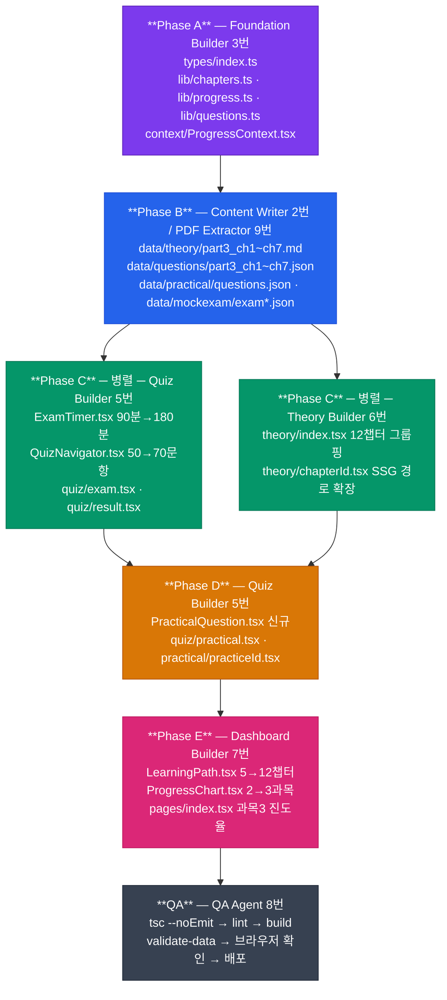

# AGENTS — SQLP 사이트 개발 에이전트 정의서

## 개요

이 프로젝트는 **9개의 전문 서브에이전트** + 1개 특수 에이전트로 분업한다.  
각 에이전트는 소유 파일과 책임 범위가 명확히 구분된다.

---

## 실행 단계 (Phase A-E)

`docs/ai-dlc/README.md` 의 스킬 계획을 기반으로 한다.



---

## 에이전트별 상세 정의

---

### Agent 0 — Orchestrator (오케스트레이터)

**책임**: 전체 개발 흐름 조율, 에이전트 간 산출물 검증, 문서 최신 상태 유지

**소유 파일**
```
CLAUDE.md
docs/harness/**
docs/ai-dlc/README.md (진행 현황 업데이트)
docs/plans/ (플랜 파일 생성·관리)
```

**주요 작업**
- 각 Phase 시작 전 선행 에이전트 산출물 완료 확인
- `docs/plans/NNN_slug.md` 생성 (플랜 우선 원칙 준수)
- 빌드 오류 발생 시 원인 에이전트 식별 및 재실행 지시

---

### Agent 1 — Scaffold (스캐폴더)

**책임**: 실행 가능한 Next.js 프로젝트 골격 생성

**소유 파일**
```
package.json, tsconfig.json, next.config.js
tailwind.config.js, postcss.config.js, .eslintrc.json
styles/globals.css
pages/_app.tsx, pages/_document.tsx
```

**검증 기준**
```bash
npm run dev    # 정상 실행 (localhost:3000)
npm run lint   # 0 errors
```

---

### Agent 9 — PDF Extractor (PDF 추출기)

**책임**: SQLP 시험 PDF 파일에서 이론 마크다운과 문제 JSON 생성  
**우선 순위**: PDF 원본이 있을 때 Agent 2 (Content Writer) 대신 사용

**소유 파일**
```
data/theory/part*.md
data/questions/part*.json
data/practical/questions.json
```

**사용 조건**: `docs/contents/` 에 PDF 원본 존재 시

---

### Agent 2 — Content Writer (콘텐츠 작성자)

**책임**: 이론 마크다운·문제 JSON·실기 문제 생성 및 관리

**소유 파일**
```
data/theory/
  part1_ch1.md, part1_ch2.md
  part2_ch1.md, part2_ch2.md, part2_ch3.md
  part3_ch1.md ~ part3_ch7.md  [신규 7개]

data/questions/
  part1_ch1.json, part1_ch2.json
  part2_ch1.json, part2_ch2.json, part2_ch3.json
  part3_ch1.json ~ part3_ch7.json  [신규 7개]

data/practical/
  questions.json  [신규 — SQL튜닝 3유형 + 트러블슈팅 2유형]

data/mockexam/
  exam1.json, exam2.json  [70문항 구성으로 업데이트]
```

**데이터 규칙**
- 이론 MD: `# {N}과목 {M}장` 시작, `## 주요항목`, `### 세부항목`
- 문제 JSON: ID 형식 `p{N}c{M}_{DDD}`, `answer` 0-based
- Part 3 문제 목표: ch1(30) ch2(20) ch3(40) ch4(40) ch5(30) ch6(40) ch7(20)
- 실기 JSON: `practical_001` 형식, `type: 'sql-tuning' | 'troubleshooting'`

**검증 기준**
```bash
/validate-data   # JSON 스키마 오류 0
# 훅 자동 실행: "[JSON 검증] — N문항 유효"
```

---

### Agent 3 — Foundation Builder (기반 구축자)

**책임**: 공유 타입·유틸 함수·전역 상태 구현. **다른 모든 에이전트가 import하는 공유 레이어**

**소유 파일**
```
types/index.ts
lib/questions.ts
lib/theory.ts
lib/progress.ts
lib/chapters.ts
context/ProgressContext.tsx
```

**SQLP 업데이트 포인트**
- `Question.part: 1 | 2 | 3` (기존 `1 | 2` 에서 확장)
- `ExamResult.part3Score: number` 추가
- `PracticalQuestion`, `PracticalAnswer` 인터페이스 신규
- `CHAPTERS` 배열: 12챕터 (Part 3 7개 추가)
- localStorage 키: `'sqlp_progress'`
- `sampleExamQuestions()`: 70문항 (P1:10 + P2:20 + P3:40)

**검증 기준**
```bash
npx tsc --noEmit   # 타입 오류 0
npm run test       # 단위 테스트 통과
```

---

### Agent 4 — Layout Builder (레이아웃 빌더)

**책임**: 공통 레이아웃(TopBar), `_app.tsx` Provider 연결

**소유 파일**
```
components/layout/Layout.tsx
components/layout/TopBar.tsx
pages/_app.tsx
```

**변경 없음**: 레이아웃 구조는 SQLD와 동일 유지

---

### Agent 5 — Quiz Builder (퀴즈 빌더)

**책임**: 문제풀이 기능 및 실기 연습 페이지

**소유 파일**
```
components/quiz/
  QuestionCard.tsx
  AnswerFeedback.tsx
  QuizNavigator.tsx       ← 50 → 70문항 그리드
  ExamTimer.tsx           ← 90분 → 180분
  PracticalQuestion.tsx   ← [신규]

pages/quiz/
  index.tsx
  chapter/[chapterId].tsx
  exam.tsx                ← 70문항 구성, 3과목 섹션
  result.tsx              ← 3과목 점수 분리
  wrong.tsx
  bookmarks.tsx
  practical.tsx           ← [신규]

pages/practical/
  [practiceId].tsx        ← [신규, Phase D]
```

**SQLP 업데이트 포인트**
- `ExamTimer`: 90분 → 180분, 경고 임계 10분 → 20분
- `QuizNavigator`: 50문항 → 70문항 그리드 배치
- `exam.tsx`: `sampleExamQuestions()` 70문항 구성
- `result.tsx`: 3과목 점수 분리 표시
- `PracticalQuestion.tsx` 신규: 지문 + SQL 작성 textarea + 모범답안 토글 + 자기채점(0/7/15)

---

### Agent 6 — Theory Builder (이론 빌더)

**책임**: 이론 학습 페이지 (목차 + 챕터 본문)

**소유 파일**
```
components/theory/
  TheoryContent.tsx
  TheoryTOC.tsx
  RelatedQuestions.tsx

pages/theory/
  index.tsx               ← 12챕터 목록 (3과목 그룹핑)
  [chapterId].tsx         ← SSG, Part 3 챕터 경로 포함
```

**SQLP 업데이트 포인트**
- `theory/index.tsx`: 12챕터를 3과목으로 그룹핑하여 표시
- `getStaticPaths`: `lib/chapters.ts`의 12개 챕터 ID 기반

---

### Agent 7 — Dashboard Builder (대시보드 빌더)

**책임**: 메인 대시보드, 진도율 차트

**소유 파일**
```
components/dashboard/
  HeroBanner.tsx
  LearningPath.tsx        ← 5 → 12챕터 버블 (3과목 그룹)
  MascotCard.tsx
  WeeklyXP.tsx
  ProgressChart.tsx       ← 3과목 차트
  WeakChapters.tsx
  ChapterProgress.tsx

pages/index.tsx           ← 3과목 진도율 섹션
```

**SQLP 업데이트 포인트**
- `LearningPath`: 5챕터 → 12챕터, Part 1/2/3 섹션으로 그룹핑
- `ProgressChart`: 3과목 막대 차트 (기존 2과목 → 3과목)
- `pages/index.tsx`: 과목3 진도율 카드 추가

---

### Agent 8 — QA (품질 보증)

**책임**: 전체 빌드 검증, 버그 수정

**검증 순서**
```bash
npx tsc --noEmit           # 타입 오류 0
npm run lint               # ESLint 오류 0
npm run build              # SSG 성공 (12챕터 경로 생성 확인)
/validate-data             # Part 1~3 JSON 스키마 검증
npm run dev                # 브라우저 직접 확인
# → /              대시보드 3과목 표시
# → /theory        12챕터 목록
# → /quiz/exam     70문항, 180분 타이머
# → /quiz/practical 실기 연습 목록
```

---

### Chronicle (특수) — 저널 기록·회고

**책임**: 개발 과정 기록, 회고 합성

**소유 파일**
```
docs/journal/JOURNAL.md
docs/journal/LESSONS.md
```

**사용 시점**: `/log [내용]`, `/retrospect` 슬래시 명령
